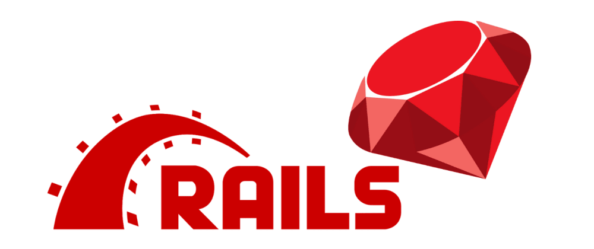
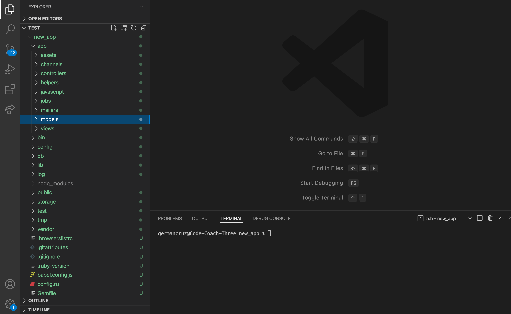
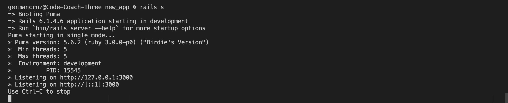
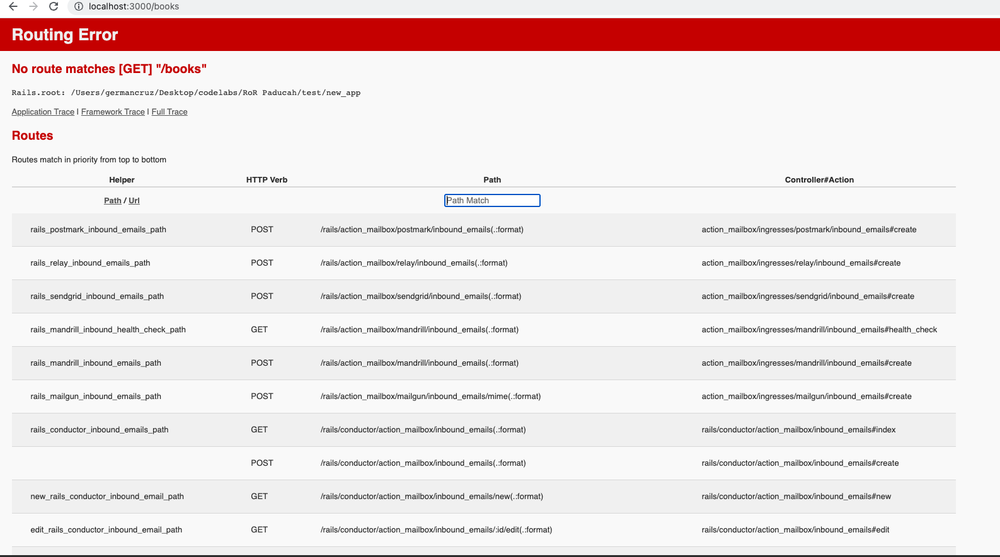
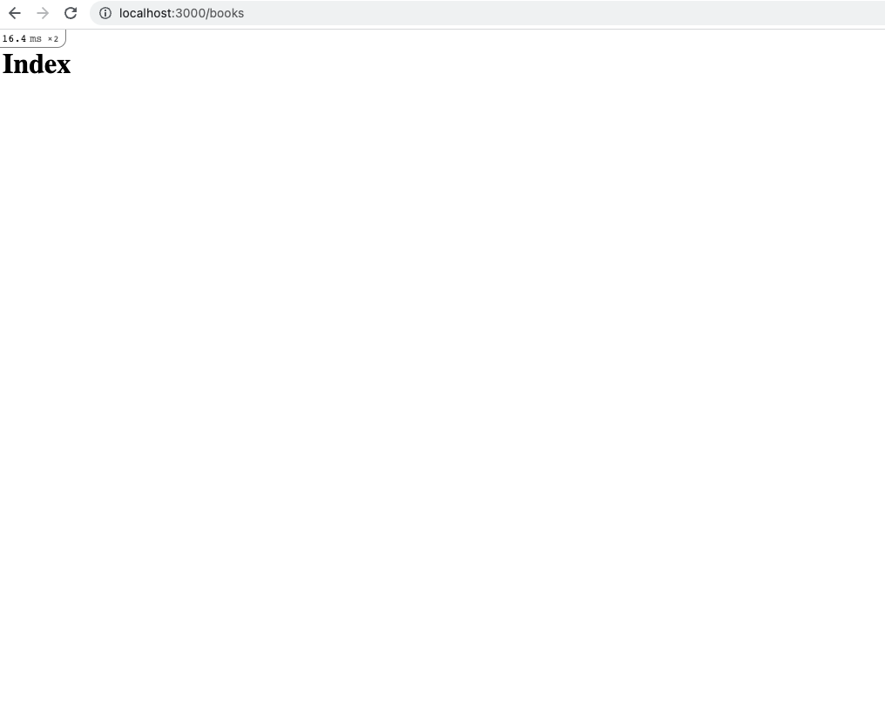
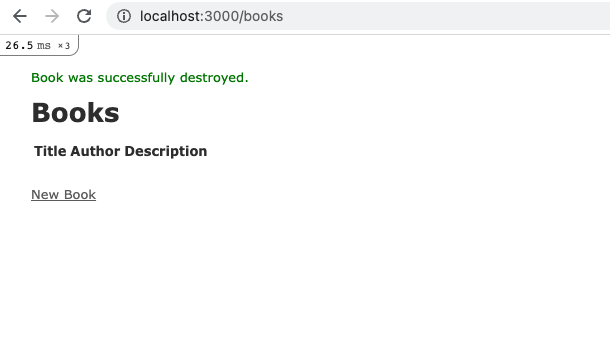

# Ruby on Rails Basics



---

### Table of Contents

- <a href="#ruby-on-rails">Ruby on Rails</a>
- <a href="#mvc">What is an MVC?</a>
- <a href="#generating-rails-app">Generate a Rails app</a>
- <a href="#layout-structure">File/Directories layout/structure</a>
- <a href="#creating-controller">Creating a Controller</a>
- <a href="#view">Creating a view/erb file</a>
- <a href="#route">Adding a route</a>
- <a href="#scaffold">Creating a scaffold</a>

---

<div id="ruby-on-rails"></div>

## What is Ruby on Rails?

Ruby on Rails ('Rails' for short), is a web application framework written in Ruby. Rails is used to create websites or APIs using the general-purpose programming language Ruby.

### Why Rails?

- Rails is a extremely fast productive web framework
- Easy to use and great for startups
- Open source framework used for backend databases APIs

### Full Stack Rails

- Full Stack Rails provides an MVC architecture to separate different parts of the logical layouts of a Full-Stack database driven web application
- Rails provides features that make it easy to communicate with all three layers of the MVC model

<div id="mvc"></div>

## MVC

Model-View-Controller, also referred to as MVC, is a pattern that allows us to separate the application into three logical units.

### Model

The model unit is concerned with the data stored within the database. It is also comprised with features that allows an object to retrieve certain information from the database. These are referred to as ORM methods.

### View

The view, like its name, is what the user will see. The view is comprised with ERB files that allows for executing of Ruby code in an HTML document. This helps when a user requests a page to the server, there may be code that can let's say "fetch user information" and display it onto the webpage.

### Controller

A controller traffics the requests a user sends. In a MVC pattern, the controller speaks directly to the model and view, and renders the neccesary UI.

<div id="generating-rails-app"></div>

## Generating a new Rails app

In a code editor such as VS code, in the terminal, generate a new Rails application by entering the following:

`rails new my-app`

You will see a newly created project folder!



<div id="layout-structure"></div>

## File/Directories layout/structure

When generating a new application, Rails is nice enough to separate different parts of the application into folders and files. It's good to know what each folder is for and our intended use for them.

---

- **App** - Organizes your aplications logic. This folder containers subdirectories such as view, controller and model.
- **App/helpers** - Referred to as `helper classes`, a way to abstract the logic into resuable components (mainly in the view side of the application)
- **App/views** - ERB files that focuses on UI of the application
- **App/views/layouts** - Pieces of UI components that can be used throughout the application using `<%= yield %>`
- **App/Controllers** - Managing requests from/to the view and managing the model logic of the application.
- **App/Model** - Handling logic/structure of the data flow of your application
- **App/stylesheets** - All css stylesheets are inserted in this directory
- **App/channel** - Channels acts as controllers for WebSocket requests by encapsulating the logic about particular works of unit, such as chat messages or notifications
- **App/javascript** - Allows JavaScript to be executed throughout your application
- **lib** - Holds Libraries
- **vendor** - Third part libaries such as vendors
- **test** - Files correlating to your apps testing
- **log** - You'll see all your requests the user has sent, there's a test.log, development.log and a production.log.
- **Config** - Configuration of files (environment.rb, routes.rb to configure oncoming requests)
- **routes.rb** - A file that transpires a list of routes the user can request for.
- **credentials.yml.enc** - environmental variables
- **DB** - SQL database that aligns data flow with tables. You can execute script to alter tables and update tables.
- **gemfile** - Gems your Rails application depends on. You can add/remove gems from your application.

---

### Rails Local Server

Launch a local server to build the Rails application with the following command (make sure you are in the project folder!):

`rails s`



Go to `localhost:3000` in the browser.

<div id="creating-controller"></div>

## Creating a Controller

Let's create a controller. A controller is referred to as a class that contains "actions". Actions are methods that direct the traffic of incoming requests to perhaps a view or taps into the database for information.

Navigate to `app/controllers` and create a file called `books_controller.rb`. Define a class called `BooksController` that inherits properties/methods from the `ApplicationController` class

```ruby
class BooksController < ApplicationController

end
```

Define an instance method called index.

```ruby
class BooksController < ApplicationController
    def index
    end
end
```

<div id="view"></div>

## Creating a VIEW/ERB file

Under `views`, create a folder called `books`, then create a file called `index.html.erb`. What does ERB mean? ERB stands for Embedded Ruby. ERB allows us to execute Ruby code in an html document. In order to do this, we must include the 'erb' file extension in each file name.

In index.html.erb, create an `h1` element with content `index`

Run `rails s` if you haven't already and enter `localhost:3000/books`. We get an error.



### No Routes matches

It's important to note that Rails gives us a chance to see all the possible routes that exist in our project. There may be an excessive amount of routes as the project grows. However, we see here that we don't have a route to display the view we've just created. Let's go ahead and do this.

<div id="route"></div>

## Adding a Route

In the routes.rb file, create a route path corresponding to the index method.

```ruby
Rails.application.routes.draw do
  get 'books', to: 'books#index'
end
```

The `get` method is an HTTP verb and Rails is highly attached to HTTP verbs. The `get` method accepts two arguments:

- First, the url extension such as 'books' that the user will request for such as `localhost:3000/books`.
- The second parameter is specifying a hash. This is the short hand way of passing in a key-value pair. The key `to` and the value `books#index`. `books` refers to the controller name follow by the name of the action, `index`. This is Rails way of connecting what each request should execute what method.

### Root in Routes

In the application controller, define a method called root and redirect to `/books`

```ruby
    def root
       redirect_to '/books'
    end
```

Go back to the `routes.rb` file, create a root path and use the root method.

```ruby
Rails.application.routes.draw do
  root 'books#root'
  get 'books', to:'books#index'
end
```

Check the browser and enter `localhost/3000`.



Every time the application starts at localhost:3000, the root path will redirect to `localhost:3000/books`

<div id="scaffold"></div>

---

## Create a Resource using Scaffold

There's a much more easier way to create a view, model and controller.

**DELETE/REMOVE all content created**

- books controller, view, routes

Use the scaffold command to generate a `book` resource

`rails generate scaffold Book title:string author:string description:text`

- **books_controller.rb methods**
  - <em>index</em> Book.all accesses all instances of Book from the database
  - <em>show</em> gets access to a partcilar book
  - <em>new</em> will create an instance of Book but will not be saved in the database
  - <em>edit</em>will create a view to edit a book
  - <em>create</em> create a book instance
  - <em>update</em> update a book instance
  - <em>destroy</em> will delete the book instance
- **views/books**
  - <em>\_form.html.erb</em> attains a form of fields that correspond to each Book Attribute that exists in the schema
  - <em>edit.html.erb</em> renders \_form.html.erb and has options to go back or show the particular book
  - <em>index.html.erb</em> renders all book instances onto the page
  - <em>new.html.erb</em> renders a form to create a new book
  - <em>show</em> shows a particular book instance
- **db/migrate**
  - migration files that will update the schema of the database

Run `rails db:migrate` in the console. The schema will be updated every time you run `rails db:migrate` if there are new migration files. If you like to go back on an update from a migration, you can always run `rails db:rollback`.

Enter `rails routes --expanded`, scroll all the way to the top to see the routes of Books. Notice the RESTful architecture Rails creates with resources.

To show routes in a much more clearer way, you can type in a random path that doesn't exist and Rails will show you the specific routes that exist in the application.

Go through the application `rails s` and navigate to `localhost:3000/books`



#### References

- https://github.com/ruby/ruby
- https://www.tutorialspoint.com/mvc_framework/mvc_framework_introduction.htm
- https://www.pluralsight.com/guides/creating-a-chat-using-rails-action-cable
- https://guides.rubyonrails.org/active_record_basics.html

---

Saw a misspelled word? Want to improve the class notes? Create a **pull request** and **contribute**!
