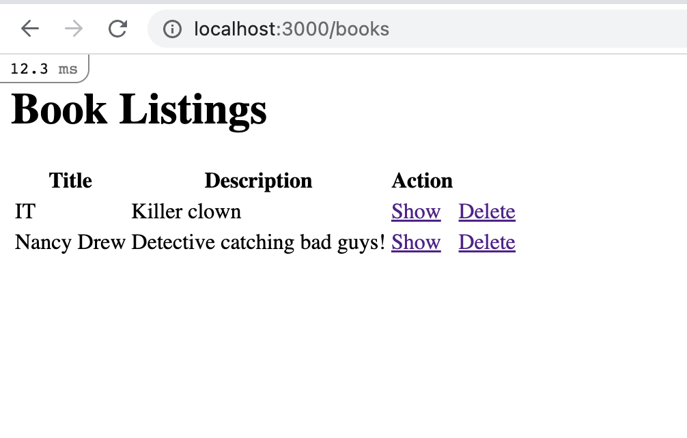
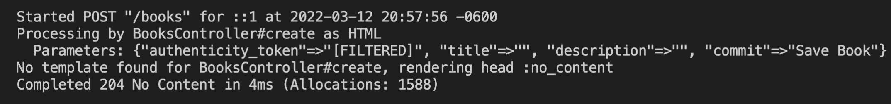
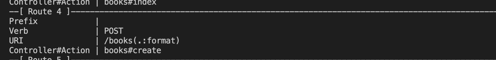
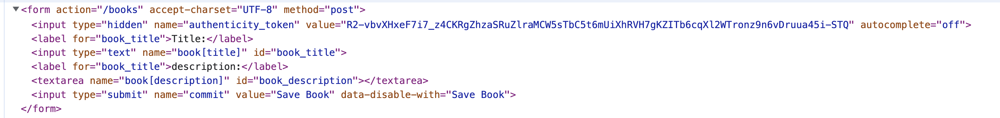
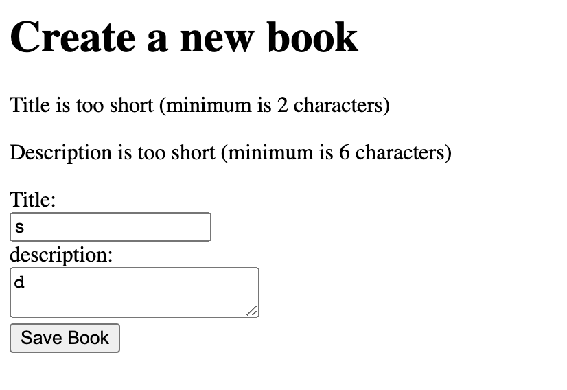
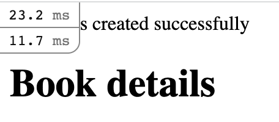
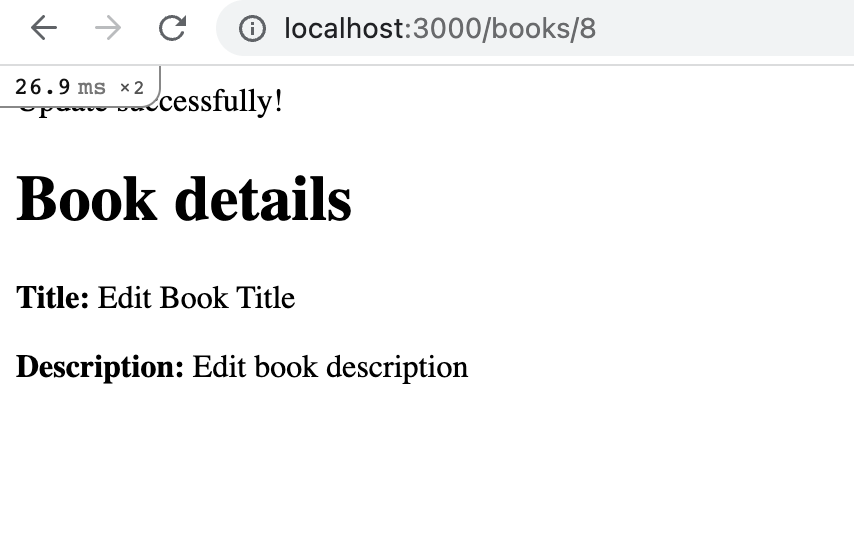

# BookIt App Part 2


### Table of Contents

- <a href="#save-book">Creating a form to save a book</a>
- <a href="#create-new-action">Create and New action</a>
- <a href="#authenticity-token">Authenticity Token</a>
- <a href="#error-messages">Error Messages</a>
- <a href="#flash-messages">Flash Messages</a>
- <a href="#edit-form">Add Form to Edit Book</a>
- <a href="#edit-update">Edit and Update Actions</a>
- <a href="#destroy-action">Destroy Action</a>
- <a href="#delete-request">Delete Request in view</a>

---

<div id ="save-book"></div>

## Creating a form to save a book

Define methods `new` and `create` under the `books_controller.rb` file. 

```ruby
    def show
        @book = Book.find(params[:id])
    end

    def index
        @books = Book.all
    end

    def new

    end

    def create

    end
```

Create `new.html.erb` under `views/books` directory. Include the following HTML:

```html
<h1>Create a new book</h1>
```

Add embedded tags and the `form_with` method to build a form.

```html
<%= form_with do |form| %> 

<% end %>
```

Include arguments `model` and `url` in `form_with` corresponding to `@book` and `books_path`. The `model` key indicates the specific type of model the form is dealing with. 

```html
<%= form_with(model: @book, url: books_path) do |form| %>

<% end %>
```

Use the reference `form` and embedded ruby tags to create labels for `title` and `description`

```html
<%= form_with(model: @book, url: books_path) do |form| %>
  <%= form.label :title, "Title:" %>
  <%= form.label :title, "description:" %> 
<% end %>
```

Create fields for `title` and `description`

```html
  <%= form.label :title, "Title:" %>
  <%= form.text_field :title %>
  <%= form.label :title, "description:" %>
  <%= form.text_area :description %>
```

Add a `submit` button

```html
  <%= form.label :title, "description:" %> 
  <%= form.text_area :description %> 
  <%= form.submit "Save Book" %>
```


Go to the route `localhost/3000/books/new`, you should see your newly created form. Click submit and you should see status 204 in the terminal. 

That is because we didn't do anything to the create method in the books controller file.


<div id ="create-new-action"></div>

## Create and New action

In `books_controller.rb,` under the `create` method, declare an instance variable called `book`.

```ruby
def create
  @book
end
```

Set book to `Book.new()`

```ruby
  @book = Book.new()
```

Pass in the corresponding values from params as arguments. 

```ruby
  @book = Book.new(title: params[:title], description: params[:description])
```
Because strong parameters allow only certain params to be requested, use require and permit methods to whitelist certain keys

Save `@book` into the database and redirect to `books/:id` of what will contain the path to the instance we created.

```ruby
    def create
        @book = Book.new(params.require(:book).permit(:title, :description))
        @book.save
        redirect_to @book
    end
```

```ruby
    def create
        @book = Book.new(params.require(:book).permit(:title, :description))
        @book.save
    end
```

Fill in the input fields and click submit(Make sure you meet your validations, book has to have a length of at least 2 characters and descriptions to be at least 6 characters when being entered. Check your book model to see validations). You should get an ERROR.


**<em>EXPLANATION</em>**: When the user requests a form to submit a book, our new action needs an instance variable to be render onto the form thus `@book = Book.new()`. Of course, there are other ways to provide the new form.

In the `new` method, Declare an instance variable called `book` and set that to an unsaved book instance.

```ruby
    def new
        @book = Book.new
    end
```


Try again and fill the input fields. And then click submit. You should get a status code 204 in the terminal `No content`. No content means we aren't returning anything back or rendering a view. Which makes sense because all we did was save our Book instance to the database. Run `rails c` and enter the following `Book.last`. You should see that your Book instance saved successfully.

When inspecting the form in the browser, you can see that the method is set to `post`.


 Method refers to what type of request is being sent. Action refers to the path, in this case `/books`. When submitting the form, you will have sent a post request to the url `/books` which will execute the `create` action. To make sure of this, in the terminal, enter `rails routes --expanded`. You should see all the list of available routes in an organized manner.


<div id="authenticity-token"></div>

## Authenticity Token

What is the Authenticity Token in the Rail forms?

  `When the user views a form to create, update, or destroy a record, the Rails app creates a random authenticity_token, stores this token in the session, and places it in a hidden field in the form.`

  
  
  
  `When the user submits the form, Rails looks for the authenticity_token, compares it to the one stored in the session, and if they match the request is allowed to continue.` [Resource](https://stackoverflow.com/questions/941594/understanding-the-rails-authenticity-token)

Why?

  `Rails prevents what is called a cross-site request forgery where a hacker may take advantage of stored data known as sessions.` [For more info](https://guides.rubyonrails.org/security.html#cross-site-request-forgery-csrf)

<div id="error-messages"></div>

## Error messages
In the `create` method, use an `if/else` statement to see if the instance saved successfully. If true, redirect to `@book`. Else, render `new.html.erb`.

```ruby
  if @book.save
      redirect_to @book
  else
    render 'new'
  end
```

In `new.html.erb`, use an `if statement` and embbeded tags to check any error messages the instance variable holds.

```html
<h1>Create a new Book</h1>

<% if @book.errors.any? %> 

<% end %>
```

In the conditional, iterate through the messages and print them to the page.

```html
<% if @book.errors.any? %> <% @book.errors.full_messages.each do |message| %>
<p><%= message %></p>
<% end %> <% end %>
```


<div id="flash-messages"></div>

## Flash messages

In the `create` method, if the book saved successfully, let's create a flash message to output a message to the `books/:id` route `"Book was saved successfully"`

```ruby
        if @book.save
            flash[:notice] = "Book was created successfully"
            redirect_to @book
        else
```

Include the flash message in `application.html.erb`.

```html
<body>
  <% flash.each do |name, message| %>
    <%= message %> 
  <% end %> 
  
  <%= yield %>
</body>
```


<div id="edit-form"></div>

## Edit Book Form

Create `edit.html.erb` under views/books directory. Navigate to new.html.erb, and copy the entire file. Paste the contents of the copied file inside of `edit.html.erb`. Change the content of the h1 element to `Edit Book` and the content of the submit button to `Update Book`.

```html
<h1>Edit Book</h1>

<% if @book.errors.any? %> 
  <% @book.errors.full_messages.each do |message| %>
    <p><%= message %></p>
  <% end %> 
<% end %> 

<%= form_with(model: @book, url: book_path) do |form| %> 
  <%=form.label :title, "Title:" %>
  <%= form.text_field :title %> 
  <%= form.label :title, "description:" %> 
  <%= form.text_area :description %> 
  <%= form.submit "Update Book" %> 
<% end %>
```

<div id="edit-update"></div>

## Edit and Update Actions

In `books_controller.rb`, define methods `edit` and `update`.

```ruby
def edit
end

def update
end
```
In the `edit` method, use the `params` hash to find the specific book indicated in the url. Store the record in an instance variable.

```ruby
    def edit
        @book = Book.find(params[:id])
    end
```

Use the `update` method to update the instance variable. Pass in the corresponding attributes from the params hash.

```ruby
  def update 
    @book = Book.find(params[:id])
    @book.update(params.require(:book).permit(:title, :description))
  end
```

Use an `if/else` statement to check if `@book` updated successfully. If `true`, add a flash message set to `Update Successfully`, then redirect to the book path. Otherwise, render the `edit` view.

```ruby
        if @book.update(params.require(:book).permit(:title, :description))
            flash[:message] = "Update successfully!"
            redirect_to @book
        else
            render 'edit'
        end
```



<div id="destroy-action"></div>


## Destroy Action

In `books_controller`.rb, define a method called `destroy`. In the `destroy` method, find the specific record that holds the id that exists in params.

```ruby
    def destroy
        @book = Book.find(params[:id])
    end
```

`Delete` the book, then redirect to the books page

```ruby
      @book = Book.find(params[:id])
      flash[:message] = "#{@book.title} was successfully deleted."
      @book.destroy
      redirect_to books_path
```

<div id="delete-request"></div>

## Setting up delete request in view

Navigate to the `index.html.erb` file to update the placeholder actions. Create a link with content `Delete` that will send a delete request to the particular book you want to delete.

```html
<tr>
  <td><%= book.title%></td>
  <td><%= book.description%></td>
  <td><%= link_to 'Delete', book_path(book), method: :delete%></td>
</tr>
```

Create a link with content with content `Show` that will send a get request to `books/:id` of the particular book.

```html
<td><%= link_to 'Show', book_path(book)%></td>
<td><%= link_to 'Delete', book_path(book), method: :delete%></td>
```

---

Saw a misspelled word? Want to improve the class notes? Create a **pull request** and **contribute**!
