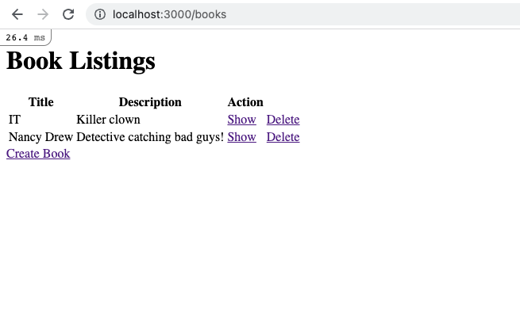
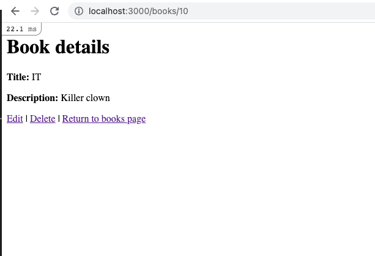
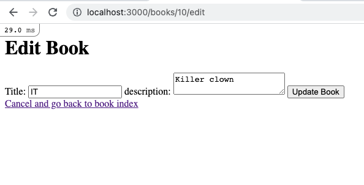
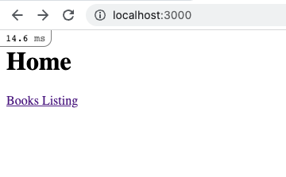
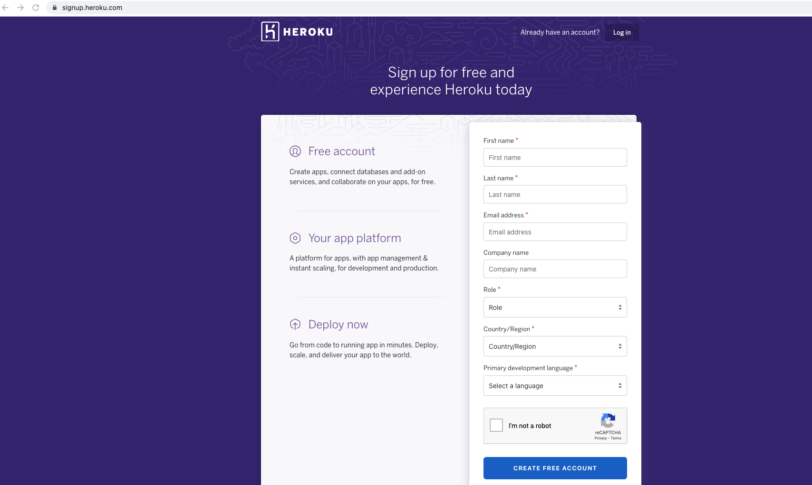
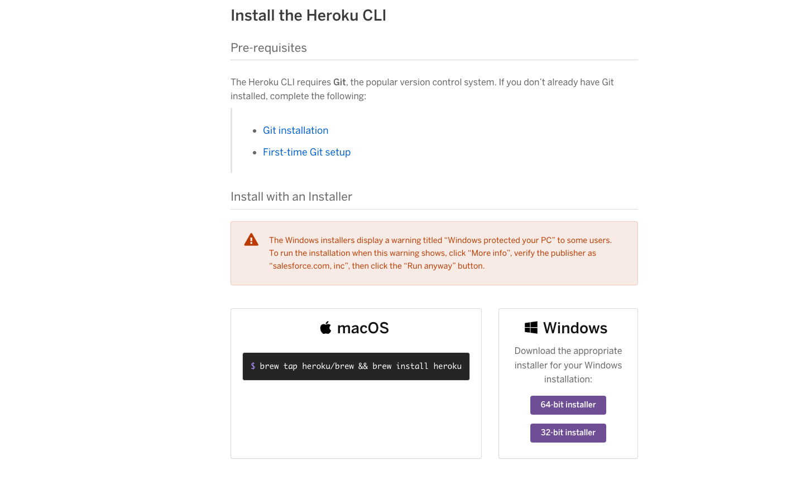
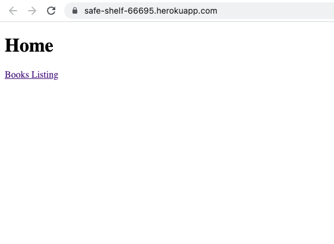

# BookIt App Part 3

### Table of Contents

- <a href="#adding-links">Adding Links to Edit or Create Books</a>
- <a href="#links-show">Adding Links to Views</a>
- <a href="#refactoring-books">Refactoring Books Controller</a>
- <a href="#refactoring-messages">Creating a Messages partial</a>
- <a href="#form-partial">Creating a Form Partial</a>
- <a href="#heroku-deployment">Heroku Deployment</a>

---

<div id="adding-links"></div>

## Adding Links to Edit or Create Books

Navigate to `index.html.erb` and create a link with content `edit`. Use the `edit_book_path` method and pass in the local reference `book` as an argument.

```html 
        <td><%= link_to 'Edit', edit_book_path(book)%> </td>
        <td><%= link_to 'Show', book_path(book)%> </td>
```

In the bottom of the erb file, include a link to create a new book. Let's use the `new_book_path` method to make this request.

```html
    <%= link_to 'Create Book', new_book_path %>
```


<div id="links-show"></div>

## Adding links to views 

Navigate to `show.html.erb`, add a link to redirect to the edit page of the book. Let's use the `edit_book_path` method. Pass in `book` as an argument.

```html
<%= link_to 'Edit', edit_book_path(@book)%>
```

Add a link to delete the specific book. Include `method` that takes `:delete` as an argument. Include a confirm prompt.

```html
<%= link_to 'Edit', edit_book_path(@book)%> | <%= link_to 'Delete', book_path(@book), method: :delete, data: {confirm: "Are you sure"} %> 
```

Use `books_path` to redirect to the page. Add a link to redirect to the index page

```html
<%= link_to 'Edit', edit_book_path(@book)%> | 
<%= link_to 'Delete', book_path(@book), method: :delete, data: {confirm: "Are you sure"} %> |
<%= link_to 'Return to books page', books_path %>
```


### More Links 

Navigate to `edit.html.erb`, in the bottom of the page, include a link with content "Cancel and go back to book index" and redirect to the book index page.
```
<%= link_to 'Cancel and go back to book index', books_path %>
```



Navigate to `home.html.erb`, include links to the books index page and the about page.

```html
<%= link_to 'Books Listing', books_path %>
```



<div id="refactoring-books"></div>

## Refactoring Books Controller
Create a private method called `set_book`. Find the book with the particular id that exists from the params hash and store it in an intance variable called book.

```ruby
    private 
    
    def set_book
        @book = Book.find(params[:id])
    end

```

Notice all methods that include the statement `@book = Book.find(params[:id])` from methods show, edit, update, destroy. 


Use `before_action` to execute `set_book` only for methods show, edit, destroy and update. `Set_book` will execute before the actions are called. This gets rid of repeated code.

```ruby
    before_action :set_book, only: [:show, :edit, :destroy, :update]
```
 
Define a private method called `book_params` that will return the permitted attributes from the params hash.

```ruby
    def book_params
        params.require(:book).permit(:title, :description)
    end
```

Remove Dry code by using `book_params` in methods create and  update
```ruby
    def create 
        @book = Book.new(book_params)
        if @book.save
            flash[:notice] = "Book was created successfully"
            redirect_to @book
        else 
            render 'new'
        end
    end
    
    def edit
    end

    def update
        if @book.update(book_params)
            flash[:message] = "Update successfully!"
            redirect_to @book
        else
            render 'edit'
        end
    end
```

<div id="refactoring-messages"></div>

## Creating a Messages Partial
Create a file called `_messages.html.erb` under the layouts directory. Navigate to `application.html.erb`, copy the code containing flash, cut and paste into `_messages.html.erb`. 

In `application.html.erb`, render the `messages` partial file.

```html
    <%= render 'layouts/messages' %>
```

<div id="form-partial"></div>

## Creating a Form Partial
Under `views/books` directory, create a file called `_form.html.erb`. Navigate to `edit.html.erb`, copy the html that includes any error messages and the entire form. Paste the embedded code in `_form.html.erb`.

```html
<% if @book.errors.any? %>
        <% @book.errors.full_messages.each do |message| %>
        <p><%= message %></p>
        <% end %>
<% end %>

<%= form_with(model: @book) do |form| %>
        <%= form.label :title, "Title:" %>
        <%= form.text_field :title %>
        <%= form.label :title, "description:" %>
        <%= form.text_area :description %>
        <%= form.submit "Update Book" %>
<% end %>
```

In both `edit.html.erb`, `new.html.erb`, replace the form and the error messages html with the following

```html
    <%= render 'form' %>
```

Example `edit.html.erb`:

```html
<h1>Edit Book</h1>

<%= render 'form'  %>

<%= link_to 'Cancel and go back to books index', books_path%>
```

<div id="heroku-deployment"></div>

## Heroku Deployment
Navigate to the `gemfile`. Remove the following line 

```ruby 
gem 'sqlite3', '~> 1.4'
```

For production, use the `pg` gem. Copy and paste the following:

```ruby
group :production do 
  gem 'pg'
end
```
For test and development, use the sqlite3 gem

```ruby 

group :development, :test do
  # Call 'byebug' anywhere in the code to stop execution and get a debugger console
  gem 'byebug', platforms: [:mri, :mingw, :x64_mingw]
  # Use sqlite3 as the database for Active Record
  gem 'sqlite3', '~> 1.4'
end

```
run `bundle install` to install the necessary gems.

1.    Push your code to github
2.    Create a Heroku Account



3.    Install the Heroku CLI



1.    Enter `heroku login` in the terminal to login to your heroku account from the browser
2.    Enter `heroku create` in the terminal
3.    Make sure you push everything to GitHub. Run `git push heroku main`. or `git push heroku master` depending on what branch you are in.

You may get an error such as 

```
remote:        Bundler Output: Your bundle only supports platforms ["x86_64-darwin-20"] but your local platform remote: is x86_64-linux. Add the current platform to the lockfile with `bundle lock remote:        --add-platform x86_64-linux` and try again. remote: 
```
Enter `bundle lock --add-platform x86_64-linux`. Push to GitHub. Then, push code to heroku master `git push heroku main` or `git push heroku master`.

1.  Migrate your database on heroku. Enter `heroku run rails db:migrate`
2.  Change the name by entering `heroku rename app-name`
3.  Enter `heroku open` to open the application in the browser.




---

Saw a misspelled word? Want to improve the class notes? Create a **pull request** and **contribute**!
