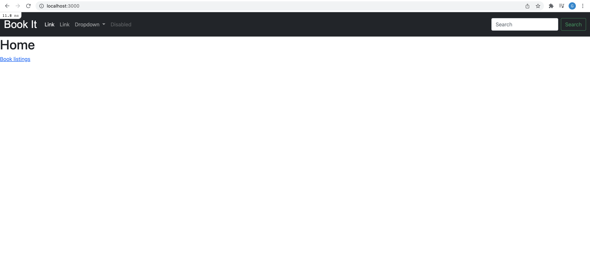
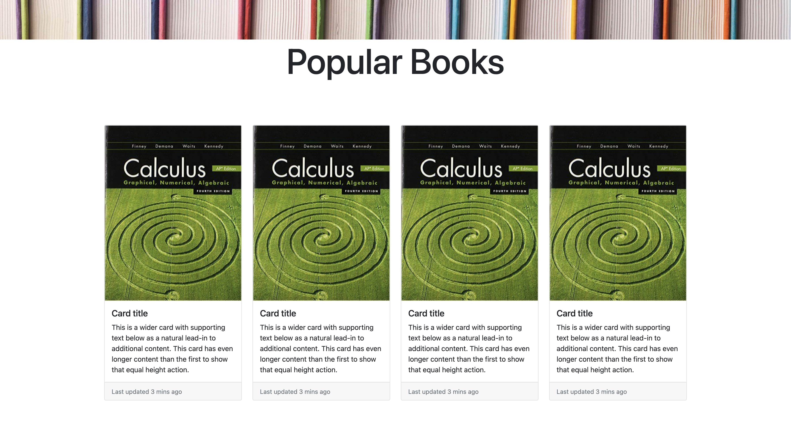
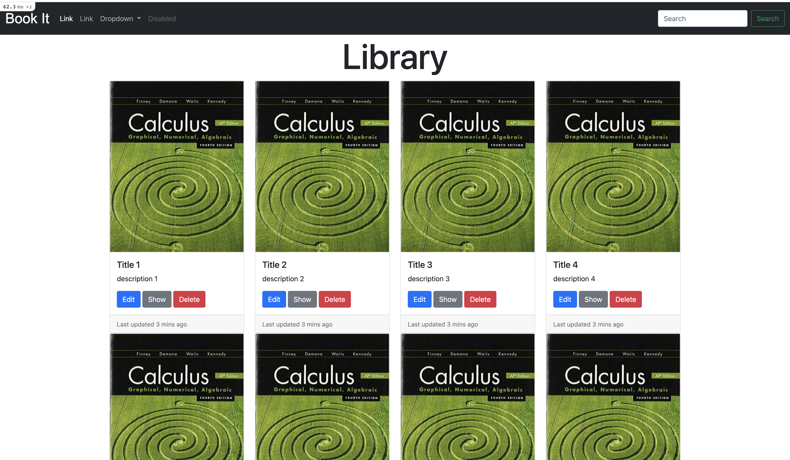
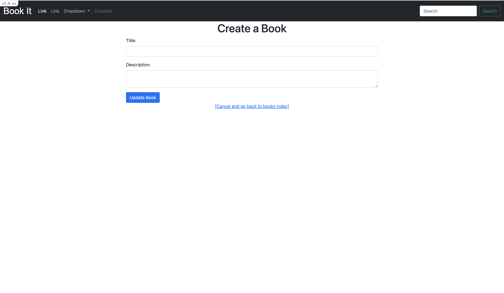
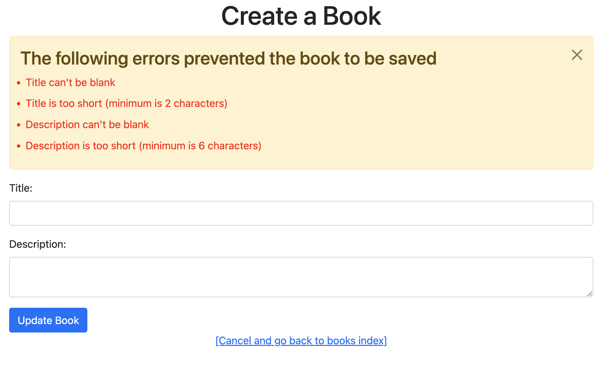
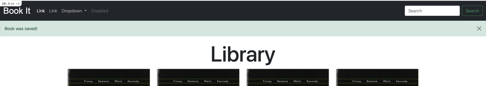
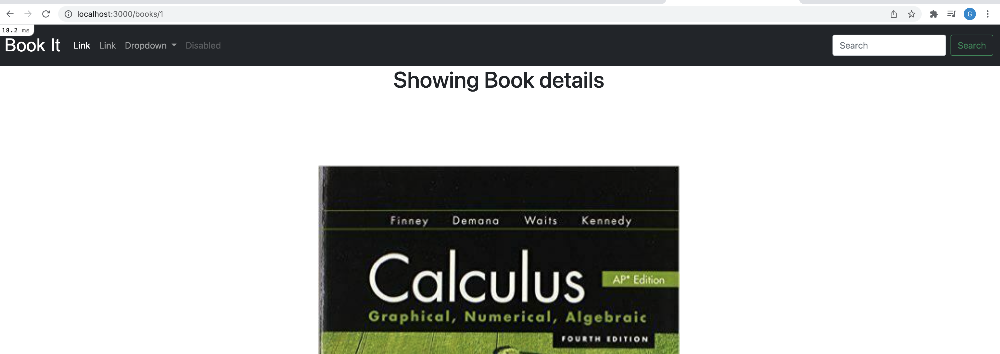
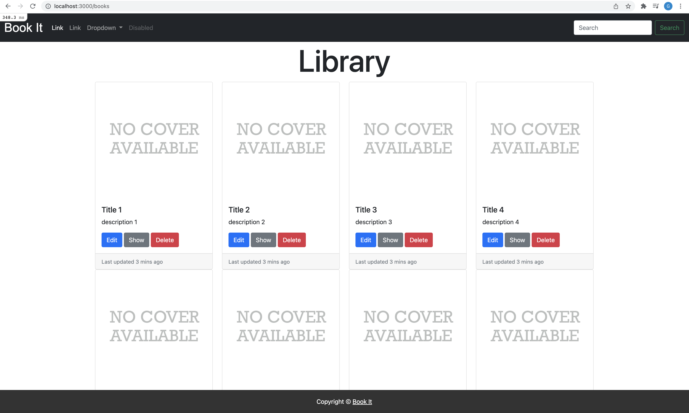
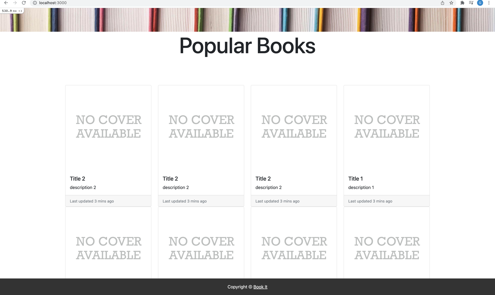
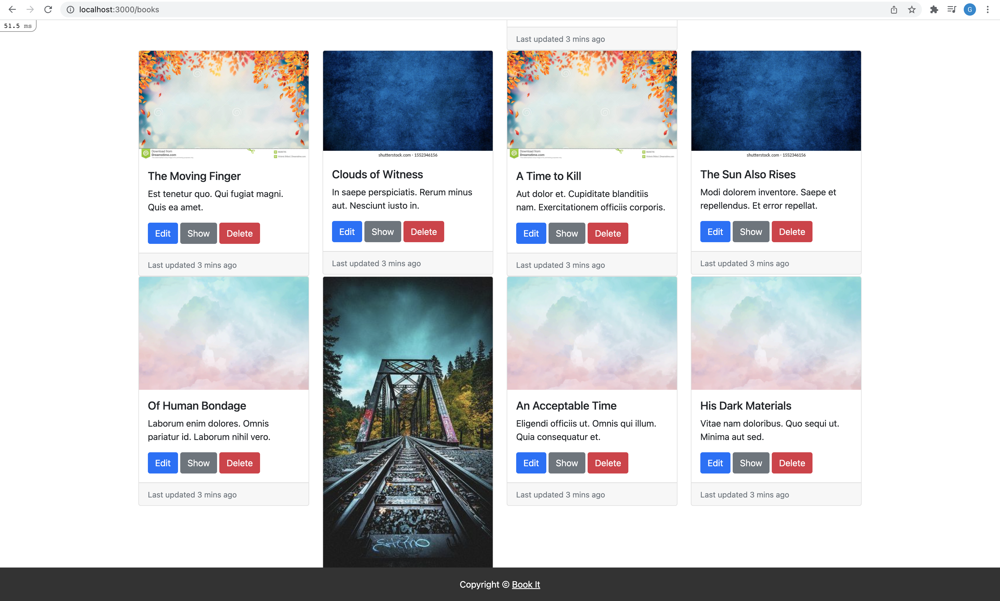

# BookIt App Part 4 - Styling


### Table of Contents

- <a href="#adding-bootstrap">Adding Bootstrap 5</a>
- <a href="#navbar">Creating a Navbar</a>
- <a href="#homepage">Styling The Homepage</a>
- <a href="#index-page">Styling Books Index Page</a>
- <a href="#form">Styling Form</a>
- <a href="#messages">Styling Messages</a>
- <a href="#show-page">Styling Show Page</a>
- <a href="#footer">Creating a footer</a>
- <a href="#image-path">Adding Image Path</a>
- <a href="#display-eight-random-books">Display Eight Random Books</a>
- <a href="#deploying-changes">Deploying Changes</a>
- <a href="#seed-file">seed.rb and The Faker Gem</a>

---

## Terminology

<details>
<summary><strong>Bootstrap</strong></summary>
<em>Bootstrap</em> is a CSS Front End Framework used to design and layout web Applications easily. What makes Bootstrap great is that it's beginner friendly and it allows making web applications responsive a painless process. As of today, Bootstrap 5 is the latest version.
</details>
<details>
<summary><strong>Rails Seed</strong></summary>
<em>Rails seed</em> is a process of populating the database without having to manually do so. This allows us to create scenarios for testing and development environments.
</details>
<details>
<summary><strong>Faker Gem</strong></summary>
<em>Faker</em> is a gem used to create fake data. Faker provides a range of categories to percieve as data such as book titles, movie titles, usernames, emails, first names, last names, and more. Each time a value is generated, it is set at random. 
</details>
<details>
<summary><strong>openURI</strong></summary>
<em>openURI</em> is a way to "open" a http or https URL as though it were a file. 
</details>

<br>

---

<div id="adding-bootstrap"></div>

## Adding Bootstrap 5

<details>
<summary>OPTION ONE</summary>

Add `bootstrap 5` to the application by entering `yarn add bootstrap jquery @popperjs/core` or `npm install bootstrap jquery @popperjs/core` for windows.

Navigate to package.json and you should see the latest version of bootstrap 5 installed

```javascript
    "@popperjs/core": "^2.11.0",
    "@rails/actioncable": "^6.0.0",
    "@rails/activestorage": "^6.0.0",
    "@rails/ujs": "^6.0.0",
    "@rails/webpacker": "5.4.3",
    "bootstrap": "^5.1.3",
    "jquery": "^3.6.0",
    "turbolinks": "^5.2.0",
```

Navigate to `app/assets/stylesheets/application.css` and copy/paste the following

```
 *= require bootstrap
 *= require_tree .
 *= require_self
 */
```

Navigate to `config/webpack/environment.ts`. Copy and paste the following

```typescript
const { environment } = require("@rails/webpacker");

const webpack = require("webpack");

environment.plugins.append(
  "Provide",
  new webpack.ProvidePlugin({
    $: "jquery",
    jQuery: "jquery",
    Popper: ["popper.js", "default"], // Not a typo, we're still using popper.js here
  })
);

module.exports = environment;
```

Navigate `app/javascript/packs/application.js` and import bootstap

```ts
import * as ActiveStorage from "@rails/activestorage";
import "channels";
import "bootstrap";
```

Navigate to `app/assets/stylesheets` and create `custom.css.scss`. To overwrite bootstrap classes, include

```css
@import "bootstrap/dist/css/bootstrap";
```

</details>

<details>
<summary>OPTION TWO</summary>
Include CDN links to your project. Navigate to [https://www.bootstrapcdn.com/](https://www.bootstrapcdn.com/) and copy the the cdn links of css and html.

Navigate to your `views/layouts/application.html.erb` file and include both links like so.

```html
<head>
  <title>BookIt</title>
  <meta name="viewport" content="width=device-width,initial-scale=1" />
  <%= csrf_meta_tags %> <%= csp_meta_tag %> <%= stylesheet_link_tag
  'application', media: 'all', 'data-turbolinks-track': 'reload' %> <%=
  javascript_pack_tag 'application', 'data-turbolinks-track': 'reload' %>
  <link
    rel="stylesheet"
    href="https://cdn.jsdelivr.net/npm/bootstrap@5.1.3/dist/css/bootstrap.min.css"
    integrity="sha384-1BmE4kWBq78iYhFldvKuhfTAU6auU8tT94WrHftjDbrCEXSU1oBoqyl2QvZ6jIW3"
    crossorigin="anonymous"
  />
  <script
    src="https://cdn.jsdelivr.net/npm/bootstrap@5.1.3/dist/js/bootstrap.min.js"
    integrity="sha384-QJHtvGhmr9XOIpI6YVutG+2QOK9T+ZnN4kzFN1RtK3zEFEIsxhlmWl5/YESvpZ13"
    crossorigin="anonymous"
  ></script>
</head>
```
</details>

<br>
<div id="navbar"></div>

## Adding a Navbar

Navigate to `app/assets/stylesheets/application.css` and change the background color of the body element.

```css
body {
  background-color: rgb(243, 243, 243);
}
```

Navigate to `app/views/layouts` and create a new file called `_navigation.html.erb`. The code below was taken from the [bootstrap 5 docs](https://getbootstrap.com/docs/5.0/components/navbar/#supported-content) and was edited. Copy and paste the following:

```html
<nav class="navbar navbar-expand-lg navbar-dark bg-dark">
  <div class="container-fluid">
    <a
      class="navbar-brand"
      href="#"
      style="font-family:serif; font-size: 2rem; font-weight:bold"
      >Book It</a
    >
    <button
      class="navbar-toggler"
      type="button"
      data-bs-toggle="collapse"
      data-bs-target="#navbarSupportedContent"
      aria-controls="navbarSupportedContent"
      aria-expanded="false"
      aria-label="Toggle navigation"
    >
      <span class="navbar-toggler-icon"></span>
    </button>
    <div class="collapse navbar-collapse" id="navbarSupportedContent">
      <ul class="navbar-nav me-auto mb-2 mb-lg-0">
        <li class="nav-item">
          <a class="nav-link active" aria-current="page" href="#">Home</a>
        </li>
        <li class="nav-item">
          <a class="nav-link" href="#">Link</a>
        </li>
        <li class="nav-item dropdown">
          <a
            class="nav-link dropdown-toggle"
            href="#"
            id="navbarDropdown"
            role="button"
            data-bs-toggle="dropdown"
            aria-expanded="false"
          >
            Dropdown
          </a>
          <ul class="dropdown-menu" aria-labelledby="navbarDropdown">
            <li><a class="dropdown-item" href="#">Action</a></li>
            <li><a class="dropdown-item" href="#">Another action</a></li>
            <li><hr class="dropdown-divider" /></li>
            <li><a class="dropdown-item" href="#">Something else here</a></li>
          </ul>
        </li>
        <li class="nav-item">
          <a
            class="nav-link disabled"
            href="#"
            tabindex="-1"
            aria-disabled="true"
            >Disabled</a
          >
        </li>
      </ul>
      <form class="d-flex">
        <input
          class="form-control me-2"
          type="search"
          placeholder="Search"
          aria-label="Search"
        />
        <button class="btn btn-outline-success" type="submit">Search</button>
      </form>
    </div>
  </div>
</nav>
```

Transform the anchor tag containing `Book It` into a link that navigates the user to the root path of the application. Use Ruby embedded tags.

```
    <%= link_to "Book It", root_path, class: "navbar-brand", style:"font-family: arial; font-size: 2rem; font-weight; bold" %>
```

Include drop down items for the user to navigate to the index page and also to be able to create a book.

```html
<ul class="dropdown-menu" aria-labelledby="navbarDropdown">
  <li><%= link_to "Books", books_path, class: "dropdown-item"%></li>
  <li><%= link_to "Create Book", new_book_path, class: "dropdown-item"%></li>
</ul>
```

Render `_navigation.html.erb ` in `application.html.erb`

```
    <%= render 'layouts/navigation' %>
    <%= render 'layouts/messages' %>
    <%= yield %>
```



<div id="homepage"></div>

## Styling Home

Navigate to `assets/stylesheets/pages.scss` and copy/paste the following

```css
/* Installing bootstrap manually will require this (CDN do not provide us this option) */
@import "bootstrap/dist/css/bootstrap";

.home-background {
  padding: 5% 2%;
  background-size: 100% 100%;
  background-image: url("https://www.iworkinsport.com/iwis-admin/uploads/427545862167656.jpg");
  height: 90vh;
  width: 100%;
}
.home-header {
  color: white;
  font-size: 10vw;
}
.home-paragraph {
  color: white;
  font-size: 1.1vw;
}
.home-button {
  display: block;
  width: 25%;
  padding: 1% 0%;
  font-size: 2rem;
  margin: 0.5% 0%;
}

.explore {
  color: rgb(85, 85, 85);
  background-color: rgb(236, 236, 236);
  border: 1px solid rgb(187, 187, 187);
  opacity: 90%;
}

@media screen and (max-width: 1170px) {
  .home-background {
    padding: 5% 5%;
    background-size: 100% 100%;
    background-image: url("https://www.iworkinsport.com/iwis-admin/uploads/427545862167656.jpg");
    height: 91vh;
    width: 100%;
  }
  .home-header {
    color: white;
    font-size: 10vw;
  }
  .home-paragraph {
    color: white;
    font-size: 3vw;
    text-align: left;
    margin: 0 0 10% 0;
    width: 90%;
  }
  .home-button {
    display: block;
    width: 50%;
    padding: 3% 0%;
    font-size: 2rem;
    margin: 5% 0%;
  }
  .explore {
    color: rgb(85, 85, 85);
    background-color: rgb(236, 236, 236);
    border: 1px solid rgb(187, 187, 187);
    opacity: 95%;
  }
}

@media (max-height: 750px) and (max-width: 1024px) {
  .home-background {
    background-size: 100% 100%;
    background-image: url("https://www.iworkinsport.com/iwis-admin/uploads/427545862167656.jpg");
    height: 90vh;
    width: 100%;
  }
  .home-header {
    color: white;
    font-size: 7vw;
    text-align: left;
    margin: 0 0 2% 0;
  }
  .home-paragraph {
    color: white;
    font-size: 2vw;
    text-align: left;
    margin: 0 0 5% 0;
  }
  .home-button {
    display: block;
    width: 100%;
    padding: 3% 0%;
    font-size: 2rem;
    margin: 5% 0%;
  }
  .explore {
    color: rgb(85, 85, 85);
    background-color: rgb(236, 236, 236);
    border: 1px solid rgb(187, 187, 187);
    opacity: 95%;
  }
}

@media screen and (max-width: 970px) {
  .home-background {
    padding: 5% 5%;
    background-size: 100% 100%;
    background-image: url("https://www.iworkinsport.com/iwis-admin/uploads/427545862167656.jpg");
    height: 90vh;
    width: 100%;
  }
  .home-header {
    color: white;
    font-size: 10vw;
  }
  .home-paragraph {
    color: white;
    font-size: 3vw;
    text-align: left;
    margin: 0 0 10% 0;
    width: 90%;
  }
  .home-button {
    display: block;
    width: 50%;
    padding: 3% 0%;
    font-size: 2rem;
    margin: 5% 0%;
  }
  .explore {
    color: rgb(85, 85, 85);
    background-color: rgb(236, 236, 236);
    border: 1px solid rgb(187, 187, 187);
    opacity: 95%;
  }
}

@media screen and (max-width: 750px) and (max-height: 1024px) {
  .home-background {
    padding: 10% 5%;
    background-size: 100% 100%;
    background-image: url("https://www.iworkinsport.com/iwis-admin/uploads/427545862167656.jpg");
    height: 95vh;
    width: 100%;
  }
  .home-header {
    color: white;
    font-size: 10vw;
    text-align: center;
    margin: 0 0 10% 0;
  }
  .home-paragraph {
    color: white;
    font-size: 5vw;
    text-align: center;
    margin: 0 0 20% 0;
  }
  .home-button {
    display: block;
    width: 100%;
    padding: 3% 0%;
    font-size: 2rem;
    margin: 5% 0%;
  }
  .explore {
    color: rgb(85, 85, 85);
    background-color: rgb(236, 236, 236);
    border: 1px solid rgb(187, 187, 187);
    opacity: 95%;
  }
}
```

In `views/pages/home.html.erb`, let's add an intro paragraph and user related buttons. 

<details>
<summary><strong>Note</strong></summary>
This application will eventually implement a login/signup system.
</details>

```html
<div class="home-background">
  <h1 class="home-header">Discover a New Journey</h1>
  <p class="home-paragraph">
    The Book It app allows you to create, update and delete any books in your
    personal bookshelf. Join today by signing up.
  </p>

  <button class="btn btn-success btn-lg home-button">Sign Up</button>
  <button class="home-button explore">
    <a href="#library" style="color:rgb(85, 85, 85); text-decoration:none;"
      >Explore Library</a
    >
  </button>
</div>
```


Let's add another section. This section will contain information about a series of books. We can use [this style](https://getbootstrap.com/docs/5.0/components/card/). Copy and paste the following

```html
<h1 style="font-size: 5rem; text-align:center" id="library">Popular Books</h1>
<div class="container" style="padding: 5% 0%">
  <div class="row">
    <div class="col-md-3">
      <div class="card">
        
        <div class="card-body">
          <h5 class="card-title">Card title</h5>
          <p class="card-text">
            This is a wider card with supporting text below as a natural lead-in
            to additional content. This card has even longer content than the
            first to show that equal height action.
          </p>
        </div>
        <div class="card-footer">
          <small class="text-muted">Last updated 3 mins ago</small>
        </div>
      </div>
    </div>
    <div class="col-md-3">
      <div class="card">
        
        <div class="card-body">
          <h5 class="card-title">Card title</h5>
          <p class="card-text">
            This is a wider card with supporting text below as a natural lead-in
            to additional content. This card has even longer content than the
            first to show that equal height action.
          </p>
        </div>
        <div class="card-footer">
          <small class="text-muted">Last updated 3 mins ago</small>
        </div>
      </div>
    </div>
  </div>
</div>
```



<div id="index-page"></div>

## Styling Books Index Page

Navigate to `views/books/index.html.erb`. Get rid of all content in the file. Include the following

```html
<h1 style="font-size: 5rem; text-align:center" id="library">Library</h1>
<div class="container">
  <div class="row"></div>
</div>
```

Within the div that has class name 'row', use embedded tags to iterate through each book record. As we iterate through each book, we can include a `col-md-3 div ` for each record. This class will allow each element to be equally spaced. Use the instance variable and embedded tags to output title and description.

```html
<% @books.each do |book| %>
<div class="col-md-3">
  <div class="card">
    
    <div class="card-body">
      <h5 class="card-title"><%= book.title%></h5>
      <p class="card-text"><%= book.description%></p>
    </div>
    <div class="card-footer">
      <small class="text-muted">Last updated 3 mins ago</small>
    </div>
  </div>
</div>
<% end %>
```

Include buttons to edit, show or delete the book.

```html
<h5 class="card-title"><%= book.title%></h5>
<p class="card-text"><%= book.description%></p>
  <%= link_to 'Edit', edit_book_path(book), class:"link btn btn-primary" %>
  <%= link_to 'Show', book_path(book), class:"link btn btn-secondary" %>
  <%= link_to 'Delete', book_path(book), method: :delete, class:"link btn btn-danger" %>
```



<div id="form"></div>

## Styling Form

Use Bootstrap to style the form partial

```html
<% if @book.errors.any? %> 
  <% @book.errors.full_messages.each do |message| %>
    <p><%= message %></p>
  <% end %> 
<% end %>

<div style="margin: 0 25%; width:50%">
  <%= form_with(model: @book) do |form| %>
  <div class="mb-3">
    <%= form.label :title, "Title:", class:"form-label" %> <%= form.text_field
    :title, class:"form-control" %>
  </div>
  <div class="mb-3">
    <%= form.label :description, "Description:", class:"form-label" %>
    <%=form.text_area :description, class:"form-control" %>
  </div>
  <%= form.submit "Save Book", class:"btn btn-primary" %> <% end %>
</div>
```

Navigate to `edit.html.erb` and add the class text-center to the h1 element. Style the link tag.

```html
<h1 class="text-center">Edit Book</h1>

<%= render 'form' %>
<div class="text-center">
  <%= link_to '[Cancel and go back to books index]', books_path %>
</div>
```

Repeat the same process for `new.html.erb`.



<div id="messages"></div>

## Styling messages

Navigate to `_form.html.erb` and include the following in-line styles to the error messages.

```html
<% if @book.errors.any? %>
<ul class="alert alert-warning alert-dismissible fade show">
  <h3>The following errors prevented the book to be saved</h3>
  <% @book.errors.full_messages.each do |message| %>
  <li style="color:red; margin: 1%"><%= message %></li>
  <% end %>
  <button
    type="button"
    class="btn-close"
    data-bs-dismiss="alert"
    aria-label="Close"
  ></button>
</ul>
<% end %>
```

Create a file called `_errors.html.erb` under views/shared. Copy/cut the errors message from `_form.html.erb`. Paste it in `_errors.html.erb`

Render the errors partial file in `_form.html.erb`

```
<div style="margin: 0 25%; width:50%">
        <%= render 'shared/errors' %>
        <%= form_with(model: @book) do |form| %>
                <div class="mb-3">
```



Navigate to `_messages.html.erb`, use bootstrap to style the embbedded tags.

```html
<% flash.each do |name, message| %>
<ul class="alert alert-success alert-dismissible fade show">
  <%= message %>
  <button
    type="button"
    class="btn-close"
    data-bs-dismiss="alert"
    aria-label="Close"
  ></button>
</ul>
<% end %>
```



<div id="show-page"></div>

## Styling Show page

Navigate to `show.html.erb`, center the h1 element

```html
<h1 class="text-center">Showing Book details</h1>
<%= flash[:notice]%>
```

Use Bootstrap to style book details

```html
<div class="container">
  <div class="card" style="margin: 10% 25%">
    
    <div class="card-body">
      <h5 class="card-title"><%= @book.title%></h5>
      <p class="card-text"><%= @book.description%></p>
      <button class="btn btn-primary">
        <%= link_to 'Edit', edit_book_path(@book), class:"link" %>
      </button>
      <button class="btn btn-secondary">
        <%= link_to 'Return to books page', books_path, class:"link"%>
      </button>
      <button class="btn btn-danger">
        <%= link_to 'Delete', book_path(@book), method: :delete, class:"link" %>
      </button>
    </div>
    <div class="card-footer">
      <small class="text-muted">Last updated 3 mins ago</small>
    </div>
  </div>
</div>
```



<div id="footer"></div>

## Creating a Footer

Create `_footer.html.erb` under layouts and create a footer.

```html
<div
  class="footer text-center"
  style="background-color:rgb(51, 51, 51); color: white; padding: 1% 0%; position:sticky; width:100%; bottom: 0; position: fixed;"
>
  Copyright ©
  <a style="color: white" href="https://github.com" target="_blank">Book It</a>
</div>
```

Render the footer in `application.html.erb`

```html
<body>
  <%= render 'layouts/navigation' %> 
  <%= render 'layouts/messages' %> <%=
  yield%> <%= render 'layouts/footer' %>
</body>
```


<div id="image-path"></div>

## Adding Image Path

In the terminal, generate a migration file that adds the `image_path` attribute to the `books` table.

`rails generate migration add_imagePath_to_books image_path:string`

In the migration file, include a default value such as

```
  add_column :books, :image_path, :string, :default => "https://upload.wikimedia.org/wikipedia/commons/b/b9/No_Cover.jpg"
```

Run `rails db:migrate`

Navigate to the `books_controllers.rb` file, include the image_path attribute in the required params.

```
    def book_params
        params.require(:book).permit(:title, :description, :image_path)
    end
```

Navigate to `views/books/_form.html.erb`, add a label and field for the `image_path` attribute.

```html
<div class="mb-3">
  <%= form.label :image_path, "Image URL:", class:"form-label" %>
  <%=form.text_area :image_path, class:"form-control" %>
</div>
```

Navigate to `index.html.erb`, and get rid of the img element. Use the built in rails `image_tag` to produce the img element follow by the image source and class.

```html
<%= image_tag book.image_path, class: "card-img-top" %>
```



In `models/books.rb`, create a custom validation to check to see if the image url is valid. Let's use open-uri.

Add `open-uri` to your gemfile. 
```ruby
gem 'open-uri'
```

Check to see if the image path url is a valid url and its content type is an image.

```ruby
    validate :image_path_exists

    def image_path_exists
      require 'open-uri'
      begin 
        url = URI.open(image_path)
        errors.add(:image_path, "does not contain image") and return unless url.content_type.starts_with?("image")
      rescue
        errors.add(:image_path, "Invalid URL")
      end
    end
```


Navigate to `views/books/show.html.erb`, replace the `img` element with the built in image_tag provided by Rails.

```ruby
    <%= image_tag @book.image_path, class: "card-img-top" %>
```

<div id="display-eight-random-books"></div>

## Display Eight Random Books

Navigate to `app/helpers/pages_helper.rb`. In the module `PagesHelper`, define a method called `get_eight_books` that will return the first 8 books from the books table.

```ruby
module PagesHelper
    def get_eight_books
      return  Book.first(8)
    end
end
```

We can be more creative with this and get 8 random books from our database

```ruby
  def get_eight_books
    return 8.times.map { Book.all[Random.rand(Book.count)] }
  end
```

What happens if our Database is initially empty? We like to return an empty array if that is the case

```ruby
    if Book.all.count == 0
        return []
    elsif
        return  8.times.map { Book.all[Random.rand(Book.count)]}
    end
```

- In a another use case, what happens if we have more than 1 and less than 8 book records? Our logic wouldn't make sense. So let's return books if it fits that condition.

```ruby
    if Book.all.count == 0
        return []
    elsif Book.all.count < 9
        return Book.all.count.times.map{Book.all[Random.rand(Book.count)]}
    else
        return  8.times.map { Book.all[Random.rand(Book.count)]}
    end
```

Navigate to `views/layouts/pages/home.html.erb`, get rid of the card selection and instead copy and paste the following from your index.html.erb:

Get rid of button elements

```html
<div class="container" style="padding: 5% 0%">
  <div class="row">
    <% @books.each do |book| %>
    <div class="col-md-3">
      <div class="card">
        <%= image_tag book.image_path, class: "card-img-top" %>
        <div class="card-body">
          <h5 class="card-title"><%= book.title%></h5>
          <p class="card-text"><%= book.description%></p>
        </div>
        <div class="card-footer">
          <small class="text-muted">Last updated 3 mins ago</small>
        </div>
      </div>
    </div>
    <% end %>
  </div>
</div>
```

Instead of iterating through `@books`, replace `@books` with the `get_eight_books` method. This will allow us to iterate through the first 8 records that exists in the database.

```html
<% get_eight_books.each do |book| %>
```



<div id="deploying-changes"></div>

## Deploying changes

- You can always add automatic builds to your repo's main branch. Here we will use the command line to push those changes

  - Enter `git push heroku master`
  - Enter `heroku run rails db:migrate`
  - Let's wipe out the database to accomodate the new attribute image_path and include a seed file.

- Enter `heroku run rails c`, this will allow you to run ORM commands in the terminal that has your production database on Heroku.
- enter `Book.destroy_all` this will destroy all the books (NOTE: This is only for demonstration purposes, normally you do NOT do this for production).
- exit the terminal

<div id="seed-file"></div>

## Populating The DB with seed.rb and The Faker Gem

I want to be able to output many records without manually doing it. I will use programming basics to iterate from 1 through 100 to create book records in `db/seeds.rb`. I will use the `faker` gem to help me store data.

Navigate to the `Gemfile` and include the faker gem in development and test. Run `bundle install`

```ruby
group :development, :test do
  # Call 'byebug' anywhere in the code to stop execution and get a debugger console
  gem 'byebug', platforms: [:mri, :mingw, :x64_mingw]
  # Use sqlite3 as the database for Active Record
  gem 'sqlite3', '~> 1.4'
  gem 'faker', :git => 'https://github.com/faker-ruby/faker.git', :branch => 'master'
end
```

Navigate to `db/seeds.rb`. Require faker at the top of the file

```ruby
require 'faker'
```

Create a local variable called images that contain 4 image address(you can google these).

```ruby
require 'faker'
images = [
    "https://image.shutterstock.com/image-photo/blue-background-texture-260nw-1552346156.jpg",
    "https://img.freepik.com/free-vector/hand-painted-watercolor-pastel-sky-background_23-2148902771.jpg?size=626&ext=jpg",
    "https://thumbs.dreamstime.com/z/beautiful-autumn-foliage-background-brunches-falling-tree-leaves-sky-bokeh-98280795.jpg",
    "https://i.pinimg.com/474x/80/38/ea/8038ea15024f5c34926bf7418999b573.jpg",
]
```

Iterate from 1 to 100 and create a Book record using Faker. Use the built in Random class to randomly get an image address for each record.

```ruby
require 'faker'
images = [
    "https://image.shutterstock.com/image-photo/blue-background-texture-260nw-1552346156.jpg",
    "https://img.freepik.com/free-vector/hand-painted-watercolor-pastel-sky-background_23-2148902771.jpg?size=626&ext=jpg",
    "https://thumbs.dreamstime.com/z/beautiful-autumn-foliage-background-brunches-falling-tree-leaves-sky-bokeh-98280795.jpg",
    "https://i.pinimg.com/474x/80/38/ea/8038ea15024f5c34926bf7418999b573.jpg",
]
(1..100).each do |n|
    Book.create(title: Faker::Book.title, description: Faker::Lorem.paragraph, image_path: images[Random.rand(4)] )
end
```

Run `rails db:seed`



<br>

---

## _Class Exercises_

- [link](https://github.com/cruzgerman216/CodeLabs-Ruby-on-Rails-Exercises/blob/main/exercises/Ruby%20on%20Rails/C11-Styling.md)

<br>

---

## *Additional Resource*s

### Docs

- [Bootstrap 5](https://getbootstrap.com/docs/5.0/getting-started/introduction/)
- [Faker Gem](https://github.com/faker-ruby/faker)
- [net/http](https://ruby-doc.org/stdlib-3.1.1/libdoc/net/http/rdoc/Net/HTTP.html)

### Videos

- [Bootstrap 5 Crash Course](https://www.youtube.com/watch?v=4sosXZsdy-s&ab_channel=TraversyMedia)
- [Faker Gem](https://www.youtube.com/watch?v=Df97jFmq2Fo&ab_channel=BrainTrustDigital)
- [Seeding Data in Rails Overview](https://www.youtube.com/watch?v=_HSudwhdAR8&ab_channel=MikeRogers)
- [Seeding Data in Rails Demonstration](https://www.youtube.com/watch?v=scYmaok52j8&ab_channel=APPSIMPACTAcademy)

### Articles

- [Faker Gem](https://tosbourn.com/using-faker-with-rspec/)
- [Seed data](https://launchschool.com/books/demystifying_rails/read/seeding_the_database)
  <br>

### Other Resources

- [The History of Bootstrap](<https://en.wikipedia.org/wiki/Bootstrap_(front-end_framework)>)

---

:wave: Saw a misspelled word? Want to improve the class notes? Create a **pull request** and **contribute**!
