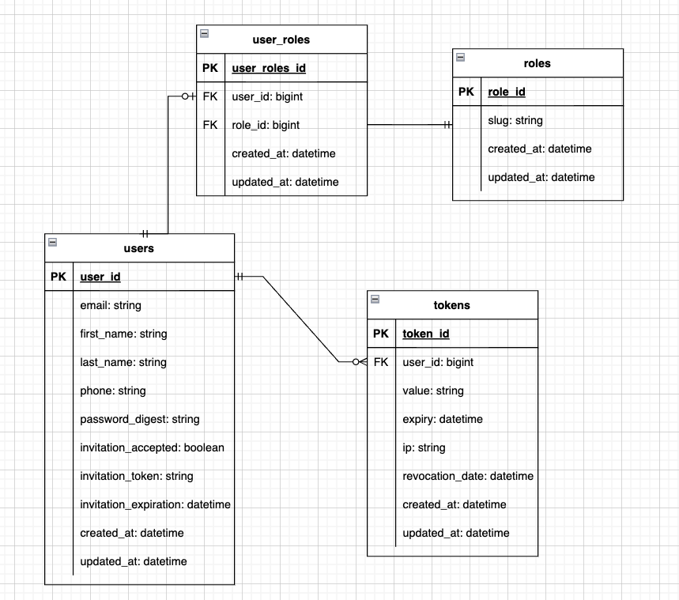

      ___  __  ____  ____  ____  __    ____   __   ____  ____     __   ____  __
     / __)/  \(    \(  __)(  __)(  )  (  _ \ / _\ / ___)(  __)   / _\ (  _ \(  )
    ( (__(  O )) D ( ) _)  ) _)  )(    ) _ (/    \\___ \ ) _)   /    \ ) __/ )(
     \___)\__/(____/(____)(__)  (__)  (____/\_/\_/(____/(____)  \_/\_/(__)  (__)


### Video Introduction
[Base API Intro/using Postman to test API endpoints](https://www.youtube.com/watch?v=yPEIUxj2SyU&ab_channel=GermanCruz)

# Getting Started with the Base API

---

### Table of Contents

- <a href="#Introduction">Introduction</a>
- <a href="#Getting-Started">Getting Started with the Base API</a>
- <a href="#gemfile">Gemfile</a>
- <a href="#schema">Schema</a>
- <a href="#models">Models</a>

---

## Terminology

<details>
  <summary><strong>API</strong></summary>
  <em>API</em> is an ancronym for application programming interface. An API is a rigid guildline in allowing two applications to communicate with each other. 
</details>

---

<div id="Introduction"></div>

## Introduction

You have now experience a Full Stack Ruby on Rails development process. It's more and more apparent however that, Rails is used not only for it's MVC architect but for API purposes! That's right, with the advent of Front End Frameworks (Angular), Rails can definitely be used in the server side as an API!

### What is an API?

API stands for application programming interface. An API is the communication between two programs or computers. One specific type of API we will focus on are RESTful APIs

REST stands for Representational State Transfer. In REST, HTTP verbs are standard protocol, here's an example of how these HTTP Verbs align with Rails actions. The good thing is, Rails already has RESTful like features built in as we've seen throughout the curriculum.


### Client-Server Architecture

The specific type of relationship we like to build is the client-server architecture. This style pattern allows our client side application (Angular app) to communicate with our server/Back End Rails API. This standard principle introduces a separation of concerns in which dissembles two applications. One side, client side. The other side, server side. This improves scalability and "it allows components to evolve indepedently".


---

<div id="Getting-Started"></div>

## Getting Started with the Base API

Before we start, keep in mind when reading code, how descriptive and how meaningfully worded each method, attributes, ect are. Clean code will really help you understand what something will do without knowing the logic behind it.

The Base API, provided by the Codefi team, is an **AWESOME** starter kit for developing a Rails API. The purpose of this section of the Back End is to get use to pre-existing code that's been handed to you, absorb all of it's available features and develop amazing APIs. We expect that when you are going into a technical interview, you will explain the workflow of the API and how you used it to your advantage. Keep in mind, we won't be using all of it's features (sending emails to users unless you really want to pay for that service) in the course but perhaps later down the road, you will. Sure you can [develop your own API from sratch](https://guides.rubyonrails.org/api_app.html) but again, the purpose of this module is to add features to pre-existing code and create a Full Stack Application (Front End Angular/Back End Rails). When you get hired, the first thing you'll do is get use to the code base and from there, add features. We are simulating that environment here.

Here is the [remote repository](https://github.com/leehodges/CodeLabsApi) for the base API we will be using. Click `use this template`.

Please fork the repo and start using it. These notes will guide you in understanding the Base API and explore it's available features. Expirement. Get curious and start building!

### README

The `README.md` should be the very first thing you go over. The `README.md` file will go over the necessary steps to confguring the API. Let's go over it!

### Version Requirement

The API is written in Ruby `3.0.2` and Rails `6.1.4`. This API has not been upgraded to 7 just yet.

### Setup

From the [README.md](https://github.com/leehodges/CodeLabsApi#readme) there are two paths to the setup: `New Projects` and `Existing Project`. In this case, we are starting out fresh so we will go ahead with the `New Projects` setup.

### Rails Encrypted Credentials

When our application interacts with an external service, there will be times we will need keys/tokens to unlock the features of this service. Exposing this information to the public is dangerous and people can take advantage of this sensitive information. For instance, if your open source project is in GitHub, you don't want to share your private information. Pushing sensitive information should never be pushed to GitHub. In other instances, perhaps in a private environment, your local settings may not be suitable to your team. This is where Rails Encrypted Credentials come into play.


Credentials such as keys/token/ect are stored in an encrypted file called `credentials.yml.enc`. Let's go ahead and generate this file.

Run `bin/rails credentials:edit`. We get an error

```No $EDITOR to open file in. Assign one like this:

EDITOR="mate --wait" bin/rails credentials:edit

For editors that fork and exit immediately, it's important to pass a wait flag,
otherwise the credentials will be saved immediately with no chance to edit.
```

In order to run this command, you would first need to include your code editor in the format of

`EDITOR="code --wait" bin/rails credentials:edit`

`code` represents VS Code. Run `EDITOR="code --wait" bin/rails credentials:edit` in your terminal. This command will generate a new file called `master.key` and `credentials.yml.enc.` This is a way to store the applications hidden keys.

<details>
  <summary><strong>Note</strong></summary>
In order for you to decrypt `credentials.yml.enc` and see your hidden keys, you first would need the `master.key`. When running `EDITOR="code --wait" bin/rails credentials:edit` again, Rails will look for `master.key` and use it to decrypt `credentials.yml.enc`. `mastery.key` holds a value that you want to share with your team (this file is automatically ignored so we don't have to worry about accidently pushing to github).
</details>

### Adding Environmental Variables

Once you have opened `credentials.yml.enc`, go ahead and include all environment variables. Make sure they are indented correctly in the format of:

```ruby
    invitation:
         url: 'https://urlhere'

    twilio:
        default_number: '555-555-5555'
        account_sid: 'sid_here'
        auth_token: 'auth_token'

    sendgrid:
        default_email: 'fillthisout@email.com'
        domain: 'domain.com'
        address: 'smtp.sendgrid.net'
        username: 'apikey' #apikey actually is the username to authenticate with api secret token below
        password: 'api_token'

    sidekiq:
        auth_username: 'username'
        auth_password: 'password'

    workers:
        max_threads: #
        min_threads: #
```

These are keys used throughout the baseAPI. Most of these keys are placed already in the application.

Let's go ahead and set the `max_threads` and `min_threads` to 5 like so

```
    workers:
        max_threads: 5
        min_threads: 5
```

### Access Rails Environment Variables

Use `Rails.application.credentials` to retrieve these values e.g, `Rails.application.credentials.sendgrid[:domain]`

For example, in `config/initializers/smtb`, this is a default setup for sendgrid.

```ruby
ActionMailer::Base.smtp_settings = {
  domain: Rails.application.credentials.sendgrid[:domain],
  address: Rails.application.credentials.sendgrid[:server],
  port: 587,
  authentication: :plain,
  user_name: Rails.application.credentials.sendgrid[:username],
  password: Rails.application.credentials.sendgrid[:api],
  :enable_starttls_auto => true
}
```

---

<div id="gemfile"></div>

## Gemfile

Let's take a look at what gems this API contains.

```ruby
source 'https://rubygems.org'
git_source(:github) { |repo| "https://github.com/#{repo}.git" }

ruby '3.0.2'

# ================== The BASICS ========================
# Bundle edge Rails instead: gem 'rails', github: 'rails/rails', branch: 'main'
gem 'rails', '~> 6.1.4', '>= 6.1.4.1'
# Use postgresql as the database for Active Record
gem 'pg', '~> 1.1'
# Use Puma as the app server
gem 'puma', '~> 5.0'
# Specify version, per dependabot
gem 'activesupport', '>= 6.1.3.1'
# Use Redis adapter to run Action Cable in production
gem 'redis', '~> 4.0'
# Use Active Model has_secure_password
gem 'bcrypt', '~> 3.1.7'
# Reduces boot times through caching; required in config/boot.rb
gem 'bootsnap', '>= 1.4.4', require: false

# ======================== RACK GEMS =======================
# Use Rack CORS for handling Cross-Origin Resource Sharing (CORS), making cross-origin AJAX possible
gem 'rack-attack'
gem 'rack-cors'

# ======================== Background Jobs Gems ========================
gem 'sidekiq'
gem 'sidekiq-scheduler'

# ======================== Communication Gems ========================
gem 'sendgrid-ruby'
gem 'twilio-ruby'

# ======================== JSON Serialization Gems ========================
gem 'blueprinter'
gem 'oj'
gem 'oj_mimic_json'

# ======================== Miscellaneous Gems ========================
gem 'to_bool', '~> 2.0'
gem 'faker', :git => 'https://github.com/faker-ruby/faker.git', :branch => 'master'

# ======================== Development Gems ========================
group :development, :test do
  # Call 'byebug' anywhere in the code to stop execution and get a debugger console
  gem 'byebug', platforms: [:mri, :mingw, :x64_mingw]

  gem 'factory_bot_rails'
end

group :development do
  gem 'annotate'
  gem 'listen', '~> 3.3'
  # Spring speeds up development by keeping your application running in the background. Read more: https://github.com/rails/spring
  gem 'spring'
  # The commented out gem below speeds up spring, but is currently not compatible with latest version of Rails, it should be compatible shortly,
  # check projects github to subscribe to updates
  # gem 'spring-watcher-listen'

end

# Windows does not include zoneinfo files, so bundle the tzinfo-data gem
gem 'tzinfo-data', platforms: [:mingw, :mswin, :x64_mingw, :jruby]
# If Platform Windows, monitor window directory changes
gem 'wdm', '>= 0.1.0' if Gem.win_platform?
```

```
I try to use as few gems as possible to achieve what needs done. While there are many gems for doing nearly anything, I've found that they often add significant amounts of memory bloat, and that I can often implement the limited set of functionalities I need that the gem provides with just a little bit of work. So, keep it lean; Rails makes it very easy to run high-memory applications.
```

#### Sidekiq and Sidekiq scheduler

```ruby
# ======================== Background Jobs Gems ========================
gem 'sidekiq'
gem 'sidekiq-scheduler'
```

[Sidekiq](https://github.com/mperham/sidekiq) is a service for background workers. You will need to run [Redis](https://www.rubyguides.com/2019/04/ruby-redis/) to store jobs. You can think of workers being scheduled to do certain jobs such as emailing a user for their monthly bill. We aren't concerned with Sidekiq at the moment but it's helpful to know what it is.

#### Sengrid

[Sendgrid](https://github.com/sendgrid/sendgrid-ruby) will allow you to send emails using their service.

#### Twilio

[Twilio](https://github.com/twilio/twilio-ruby) will allow you to send sms messages using their service.

#### BluePrinter

A easy and organize way to serialize your data.

<div id='schema'></div>

## Schema

Before diving into a Rails application, let's check out what our schema looks like.

```ruby

ActiveRecord::Schema.define(version: 2021_11_22_185403) do

  # These are extensions that must be enabled in order to support this database
  enable_extension "plpgsql"

  create_table "roles", force: :cascade do |t|
    t.string "slug"
    t.datetime "created_at", precision: 6, null: false
    t.datetime "updated_at", precision: 6, null: false
  end

  create_table "tokens", force: :cascade do |t|
    t.bigint "user_id", null: false
    t.string "value"
    t.datetime "expiry"
    t.string "ip"
    t.datetime "revocation_date"
    t.datetime "created_at", precision: 6, null: false
    t.datetime "updated_at", precision: 6, null: false
    t.index ["user_id"], name: "index_tokens_on_user_id"
  end

  create_table "user_roles", force: :cascade do |t|
    t.bigint "user_id", null: false
    t.bigint "role_id", null: false
    t.datetime "created_at", precision: 6, null: false
    t.datetime "updated_at", precision: 6, null: false
    t.index ["role_id"], name: "index_user_roles_on_role_id"
    t.index ["user_id"], name: "index_user_roles_on_user_id"
  end

  create_table "users", force: :cascade do |t|
    t.string "email"
    t.string "first_name"
    t.string "last_name"
    t.string "phone"
    t.string "password_digest"
    t.boolean "invitation_accepted", default: false
    t.string "invitation_token"
    t.datetime "invitation_expiration"
    t.datetime "created_at", precision: 6, null: false
    t.datetime "updated_at", precision: 6, null: false
    t.index ["email"], name: "index_users_on_email", unique: true
  end

  add_foreign_key "tokens", "users"
  add_foreign_key "user_roles", "roles"
  add_foreign_key "user_roles", "users"
end
```

Here is a visual representation of the schema in a ERD.



Let's talk about the data here. The base API has provided a series of tables: `users`, `roles`, `user_roles`, and `tokens`.

#### Users table

The users table has common attribute such as

```ruby
  create_table "users", force: :cascade do |t|
    t.string "email"
    t.string "first_name"
    t.string "last_name"
    t.string "phone"
    t.string "password_digest"
    t.boolean "invitation_accepted", default: false
    t.string "invitation_token"
    t.datetime "invitation_expiration"
    t.datetime "created_at", precision: 6, null: false
    t.datetime "updated_at", precision: 6, null: false
    t.index ["email"], name: "index_users_on_email", unique: true
  end
```

Notice how we have attributes `invitation_accepted`, `invitation_token`, `invitation_expiration`. These are mainly for verifying an email by sending an invitation email.

#### User_Roles table

```ruby
  create_table "user_roles", force: :cascade do |t|
    t.bigint "user_id", null: false
    t.bigint "role_id", null: false
    t.datetime "created_at", precision: 6, null: false
    t.datetime "updated_at", precision: 6, null: false
    t.index ["role_id"], name: "index_user_roles_on_role_id"
    t.index ["user_id"], name: "index_user_roles_on_user_id"
  end
```

This table will establish a connection between the users table and the roles table.

#### Roles table

```ruby
  create_table "roles", force: :cascade do |t|
    t.string "slug"
    t.datetime "created_at", precision: 6, null: false
    t.datetime "updated_at", precision: 6, null: false
  end
```

The roles table will keep track of the type of role a user has via `slug`.

If you navigate to `migrations/20211122185138_create_user_roles`, notice `references`.

```ruby
      t.references :user, null: false, foreign_key: true
      t.references :role, null: false, foreign_key: true
```

References will create an index for user and role. An index is a schema object that contains an entry for each value that appears in the indexed column(s) of the table or cluster and provides direct, fast access to rows. Setting `foreign_key` to `true` will also provide foreign keys.

<div id="models"></div>

## Models

Let's talk about the models of the Base API. Remember, models provide methods that are commonly used queries. We sometimes make our own custom queries. These methods don't have to be only for custom queries, maybe we like to add validations to prevent what can be saved to the database. Even as important are associations, relationships amongs two types of entities in our DB.

### User model

The user model is the most complex out of the models provided by the base API. There's a lot going on! Let's read from top to bottom.

```ruby
has_secure_password validations: false
```

By including the argument `validations:false`, this will remove validations. [source](https://api.rubyonrails.org/classes/ActiveModel/SecurePassword/ClassMethods.html)

<br>

```ruby
  has_many :tokens
  has_many :user_roles
  has_many :roles, through: :user_roles
```

Each user has a set of relationships with multiple entities. For example, in the base API, a user can have multiple tokens. This is necessary to have when logging in and being able to authorize user requests.

The next set of relationships are `user_roles` and `roles`. Creating a `has_many` relationship through `user_roles`, allows each user record to return their roles.

```ruby
validates :email, uniqueness: true
```

Every email has to be unique.

```ruby
  scope :invite_not_expired, -> { where('invitation_expiration > ?', DateTime.now) }
  scope :invite_token_is, ->(invitation_token) { where(invitation_token: invitation_token) }
```

- `invite_not_expired` returns every user who's invite is not expired.
- `invite_token_is` returns a user with the same invitation token.

More on [scopes](https://www.rubyguides.com/2019/10/scopes-in-ruby-on-rails/).

```ruby
  before_create :generate_invitation_token
```

Before every user is created, an invitation token is generated. This is mainly for verifying emails. Let's inspect `generate_invitation_token`, a method defined in the user model class.

```ruby
  def generate_invitation_token
    self.invitation_expiration = DateTime.current + 7.day
    loop do
      # Once we have a random, test whether it is unique in the DB
      self.invitation_token = SecureRandom.alphanumeric(15)
      break unless self.class.exists?(invitation_token: invitation_token)
    end
  end
```

```ruby
    self.invitation_expiration = DateTime.current + 7.day
```

`generate_invitation_token` stores the expiration date in `invitation_expiration` that is 7 days long. This is always changeable. Some expiration dates are 24 hours. Depending on your opinion/use case/argument.

```ruby
    loop do
      # Once we have a random, test whether it is unique in the DB
      self.invitation_token = SecureRandom.alphanumeric(15)
      break unless self.class.exists?(invitation_token: invitation_token)
    end
```

The next part of our method is a loop. You might've never seen a `loop` like this (I'd be careful, you don't want to start an infinite loop and break everything!) but it will stop when `break` is called.

`SecureRandom.alphanumeric(15)` is going to combine a set of random digits and letters, about 15 of them in one long unreadable text. As mentioned in the ruby docs `This library (SecureRandom) is an interface to secure random number generators which are suitable for generating session keys in HTTP cookies, etc.` More on [SecureRandom](https://ruby-doc.org/stdlib-2.7.0/libdoc/securerandom/rdoc/SecureRandom.html).

The loop continues and checks to see if the random value already exists, if so (highly unlikely but possible!), continue to the next iteration and generate a new value. If it doesn't already exist, then store it in `invitation_token` and break the loop! If you have a million users, doesn't hurt to check to see if there's one that exists.

Again, notice how descriptive the method name is `generate_invitation_token`, clean and precise. Let's move on to the next line of code.

```ruby
  before_save :generate_invitation_token, if: :will_save_change_to_invitation_token?
```

In case the `invitation_token` changes before saving the user, generate an invitation token instead. More on `will_save_change_to_attribute` [here](https://apidock.com/rails/v6.0.0/ActiveRecord/AttributeMethods/Dirty/will_save_change_to_attribute%3F).

### Sending Email to Invite User

```ruby
  after_commit :invite_user, if: :saved_change_to_invitation_token?
```

`after_commit`, will execute the following method `invite_user` after the user has been saved only if the `invitation_token` attribute was changed. More on `saved_changed_to_attribute` [here](https://apidock.com/rails/v5.2.3/ActiveRecord/AttributeMethods/Dirty/saved_change_to_attribute).

But what does `invite_user` do?

```ruby
  def invite_user
    # Email the user a link with the invitation_token
    InvitationWorker.perform_async(id)
  end
```

`invite_user` is another `User` method that sends a user an email via`invitation_token`. Notice how that is being performed by `InvitationWorker`. What is that? And where does that exist? Navigate to `workers/invitation_worker.rb` and you'll see the configuration setup for sending an email. We aren't going to dive into emailing users but you can find a set of notes of a step by step process to do so [here](./../other/email-users-with-sendgrid-and-sidekiq.md).

```ruby
  def invitation_accepted_at!
    update(invitation_accepted: true, invitation_token: nil, invitation_expiration: nil)
  end
```

`invitation_accepted_at` will update the invitation attributes for when the user accepts the invitation.

### Token Model

```ruby
class Token < ApplicationRecord
  belongs_to :user
end
```

The token model creates the association between tokens and users.

### user_role Model

```ruby
# Join model that connects users to roles
class UserRole < ApplicationRecord
  belongs_to :user
  belongs_to :role

  validates_uniqueness_of :user, scope: :role
end
```

### Role Model

```ruby
# frozen_string_literal: true

# Model that stores all of the available roles
class Role < ApplicationRecord
  validates_uniqueness_of :slug, presence: true

  scope :available_roles, -> { pluck(:slug) }

  def self.valid_role?(role)
    stringified_role = role.to_s.downcase.underscore
    stringified_role.in?(available_roles)
  end
end
```

## More

### Test Suite

You can run the test suite by calling `rails test`. This project uses [MiniTest](https://guides.rubyonrails.org/testing.html).

### Background Processing

This project comes with [Sidekiq](https://github.com/mperham/sidekiq) and [Sidekiq scheduler](https://github.com/moove-it/sidekiq-scheduler) built-in as gems. Sidekiq leverages [Redis](https://www.rubyguides.com/2019/04/ruby-redis/), and Redis is provided as a gem. When running the application, you'll need to run Sidekiq alongside the normal rails server in order for the background processing to work locally.

You may want to look into utilizing something like Foreman to turn on and off all of your services at once. Otherwise, you can start Sidekiq in a new terminal by running `bundle exec sidekiq`.

## *Additional Resource*s

### Documentation

- [Rails as an api](https://guides.rubyonrails.org/api_app.html)

### Videos

- [Sidekiq and Redis](https://www.youtube.com/watch?v=aaGSh38nzq8&ab_channel=GoRails)
- [What is an API?](https://www.youtube.com/watch?v=s7wmiS2mSXY&ab_channel=MuleSoftVideos)
- [The Complete Guide to Ruby on Rails Encrypted Credentials](https://www.youtube.com/watch?v=c1sQVXU5PBM&ab_channel=Web-Crunch)
- [What is an API? (Application Programming Interface)](https://www.mulesoft.com/resources/api/what-is-an-api)

### Articles

- [Rails encrypted credentials on 6.2](https://www.engineyard.com/blog/rails-encrypted-credentials-on-6-2/)
- [Encrypted Credentials in Ruby on Rails](https://medium.com/craft-academy/encrypted-credentials-in-ruby-on-rails-9db1f36d8570)
- [Evolution of Encrypted Credentials in Rails 6.2](https://faun.pub/evolution-of-encrypted-credentials-in-rails-6-2-666ff5884628)
- [What are indexes and how to add them to your rails app](https://medium.com/@mera.stackhouse/what-are-indexes-and-how-to-add-them-to-your-rails-app-dc066d538771)
- [How to Use Scopes in Ruby on Rails](https://www.rubyguides.com/2019/10/scopes-in-ruby-on-rails/)
- [Creating a Simple Rest Api with Rails](https://medium.com/@SJTGs/creating-a-simple-rest-api-with-rails-2e913acfc46)
- [Building a RESTful API in a Rails Application]()

---

### Other Resources

- [Episode 100 - Basic Testing Introduction in Rails](https://www.youtube.com/watch?v=jQvB0QWe5Bs&ab_channel=DriftingRuby)
- [RSpec TDD - How To Unit Test Ruby On Rails 6 Apps For Absolute Beginners | 20in20 - Week 14](https://www.youtube.com/watch?v=AAqPc0j_2bg&t=20s&ab_channel=Deanin)
- [Client and Server side application](https://learn.co/lessons/dsc-2-15-04-clients-and-servers)

### Helpful Commands

- Display tables in Rails console
  - Enter `rails c`
  - Enter `ActiveRecord::Base.connection.tables`

---

:wave: Saw a misspelled word? Want to improve the class notes? Create a **pull request** and **contribute**!
