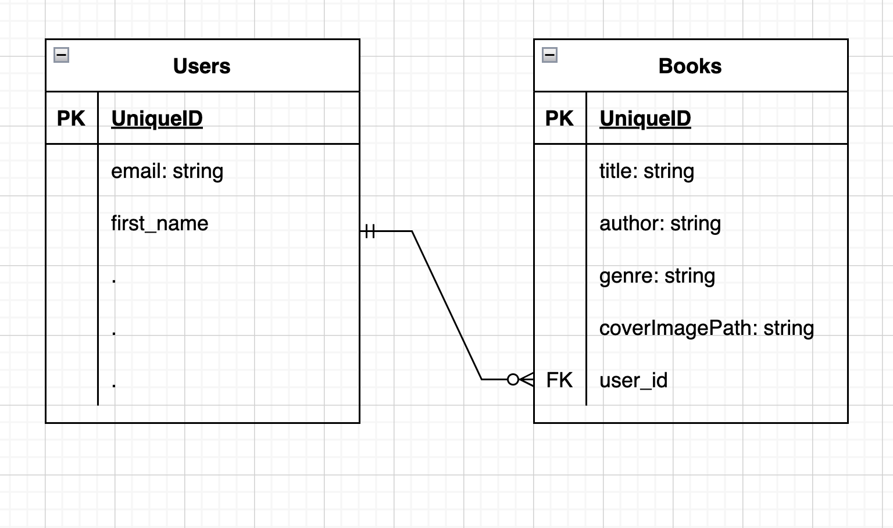
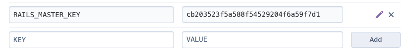

      ___  __  ____  ____  ____  __    ____   __   ____  ____     __   ____  __
     / __)/  \(    \(  __)(  __)(  )  (  _ \ / _\ / ___)(  __)   / _\ (  _ \(  )
    ( (__(  O )) D ( ) _)  ) _)  )(    ) _ (/    \\___ \ ) _)   /    \ ) __/ )(
     \___)\__/(____/(____)(__)  (__)  (____/\_/\_/(____/(____)  \_/\_/(__)  (__)

# Book It API

---

### Table of Contents

- <a href="#Introduction">Overview - Angular/Rails Stack</a>
- <a href="#Getting Started">Getting Started</a>
- <a href="#Creating-ERD">Creating ERD<a>
- <a href="#all-in-one">Generating MC files in one Command</a>
- <a href="#actions">Adding Actions to the Books Controller</a>
- <a href="#book-blueprinter">Book Blueprinter</a>
- <a href="#deploying-to-heroku">Deploying to Heroku</a>

---

<div id="Introduction"></div>

## Overview - Angular/Rails Stack

It's time to start adding endpoints to the Base API. The best way to get adjusted to a code base is to start expirementing (locally that is of course) and start adding new features.

Do you remember the application we developed in the Front End, that's right, the Book It App. Of course you do. You can probably see where this is going. That's right, we are going to take that Front End App and connect that to our Book It API. But first let's start with the API. That way we know what data we are going to deal with and what requests to be handled.

<div id="getting-started"></div>

## Getting Started

Let's start from scratch. Here is the [remote repository](https://github.com/leehodges/CodeLabsApi) for the base API we will be using. Click `use this template`.

Follow the directions in the `readme.md` file on how to setup the Base API. If you need a recap, please refer to back to the class [notes](../C21-BaseAPI-Part/C21-BaseAPI-Part-1.md)

<div id="Creating-ERD"></div>

## Creating ERD

Before we start going crazy and adding a bunch of stuff, it's important to plan out what our data looks like for our database.



<div id="all-in-one"></div>

## Generating MC files in one Command

Let's go ahead and generate

Navigate to `config/database.yml`. Change the database names for development and test.

```ruby
development:
  <<: *default
  database: BookItApi_development
```

```ruby
test:
  <<: *default
  database: BookItApi_test
```

Run `rails db:create`

`rails g resource books title:string author:string genre:string coverImagePath:string user:references`

This command will generate a series of files such as the migration file to create the books table and it's attributes, the model file and the association belongs_to user, the routes and has created the controller file. Don't forget about the test files.

`rails db:migrate`

Navigate to `models/book.rb` and include the following validations. Also complete the association by including `belongs_to` that accepts `:user` as an argument.

```ruby
class Book < ApplicationRecord
    validates :title, presence: true
    validates :author, presence: true
    validates :genre, presence: true
    validates :coverImagePath, presence: true
    belongs_to :user
end
```

Navigate to `models/user.rb` and include `has_many :books`'

```ruby
class User < ApplicationRecord
  has_secure_password validations: false
  has_many :tokens
  has_many :user_roles
  has_many :roles, through: :user_roles
  has_many :books
```

<div id="actions"></div>

## Redefing the Routes

Let's redefine the routes under `api/v1`

```ruby
  namespace :api, defaults: { format: :json } do
    namespace :v1 do
      namespace :users do
        post :login
        delete :logout
        get :me
        post :create
      end
      resources :books
    end
  end
```

## Adding Actions to the books Controller

Let's navigate to `app/controllers`. One thing our command didn't do is move our newly created controller to the correct directory. Let's drag `books_controller.rb` to `api/v1`.

For namespacing purposes, let's include the Api and V1 module. Make sure the `BooksController` class is inheriting from `Api::V1::ApplicationController`.

```ruby
module Api
    module V1
        class BooksController < Api::V1::ApplicationController
            # POST /api/v1/books
            def create 
            end
            # PATCH/PUT /api/v1/books/:id
            def update 
            end
            # DELETE /api/v1/books:id
            def delete 
            end
            # GET
            # user books - get current user books 
            def my_books 
            end
        end
    end
end
```

<div id="book-blueprinter"></div>

## Book Blue Printer

Before we send back responses, we have to go ahead and serialize our data. Create a file called `book_blueprint.rb` under `blueprinters`. Define a class that will inherit the features of blueprinter to do this.

```ruby
class BookBlueprint < Blueprinter::Base
    identifier :id
    fields :title, :author, :genre, :coverImagePath

    view :normal do
        fields :created_at, :updated_at
    end
end
```


### Create Action

Let's define the book params. 

```ruby
private 
      def book_params
        params.require(:book).permit(:title, :author, :genre, :coverImagePath)
      end
```


```ruby
      def create
        book = @current_user.books.new(book_params)
        return render_error(errors: "Error saving the book") unless book.save
        result = ServiceContract.success(book)
        payload = {
          book: BookBlueprint.render_as_hash(result.payload, view: :normal)
        }
        render_success(payload: payload)
      end
```

Notice how hard this is to read. The first 4 lines is devoted to ceating a book. And it might get more complicated, let's extract this logic into a service.

Navigate to `app/services` and create `books.rb`.

```ruby
module Books
  def self.new_book(params, current_user)
    book = current_user.books.new(params)
    return ServiceContract.error("Error saving book") unless book.save
    ServiceContract.success(book)
  end
end

```

Let's go back to `books_controller` and refactor `create`

```ruby
        result = Books.new_book(book_params, @current_user)
        render_error(errors: "There was a problem creating a new book", status: 400) and return unless result.success?
        payload = {
          book: BookBlueprint.render_as_hash(result.payload),
        }
        render_success(payload: payload)
```

### Update Action

Let's go ahead and define a service method that will update the book. Navigate to `services/books.rb`.

```ruby
module Books
  def self.new_book(params, current_user)
    book = current_user.books.new(params)
    return ServiceContract.error("Error saving book") unless book.save
    ServiceContract.success(book)
  end

  def self.update_book(book_id, params, current_user)
    book = current_user.books.find(book_id)
    return ServiceContract.error("Error updating book") unless book.update(params)
    ServiceContract.success(book)
  end
end

```

Now let's finish defining our action.

```ruby
      def update
        result = Books.update_book(params[:id], book_params, @current_user)
        render_error(errors: "There was a problem updating a book", status: 400) and return unless result.success?
        payload = {
          book: BookBlueprint.render_as_hash(result.payload),
        }
        render_success(payload: payload)
      end
```

### Destroy Action

```ruby
      def destroy
        result = Books.destroy_book(params[:id], @current_user)
        render_error(errors: "There was a problem deleting a book", status: 400) and return unless result.success?
        render_success(payload: nil)
      end
```

In the books service, define `destroy_book`.

```ruby

  def self.destroy_book(book_id, current_user)
    book = current_user.books.find(book_id)
     ServiceContract.error('Error deleting user') and return unless book.destroy
    ServiceContract.success(payload: nil)
  end
```

## Returning My Books

These restful actions are helpful in case I like to add even more features to my Front End, but I like to be able to send back a user's set of books. So let's go ahead and define a custom route. Navigate to `routes.rb`. I'm going to include this

```ruby
      # localhost:3000/api/v1/books/my_books
      namespace :books do
        get :my_books
      end
      resources :books
```

Let's then define the action.

```ruby
      def my_books
        render_success(payload: BookBlueprint.render_as_hash(@current_user.books))
      end
```

<div id="deploying-to-heroku"></div>

## Deploying to Heroku

### Before Deploying to Heroku

Because we don't have the invitation setup. Let's go ahead and navigate to `models/user.rb` and comment out a few lines of code.

```ruby
  # before_create :generate_invitation_token
  # before_save :generate_invitation_token, if: :will_save_change_to_invitation_token?
  # after_commit :invite_user, if: :saved_change_to_invitation_token?
```

Let's go ahead and deploy this to Heroku. We don't need to include the pg gem because it's already included within the Base Api.

1. Enter `heroku login` in the terminal to login to your heroku account from the browser
2. Enter `heroku create` in the terminal
3. Create a Repo and publish to GitHub. Commit all your code and push.
4. Make sure you push everything to GitHub. Run `git push heroku master`.

You may get an error such as

```
remote:        Bundler Output: Your bundle only supports platforms ["x86_64-darwin-20"] but your local platform remote: is x86_64-linux. Add the current platform to the lockfile with `bundle lock remote:        --add-platform x86_64-linux` and try again. remote:
```

Enter `bundle lock --add-platform x86_64-linux`. Push to GitHub. Then, push code to heroku master `git push heroku main` or `git push heroku master`.

Before we run `rails db:migrate` in heroku, let's go ahead and set the master key so our application has access to the encrypted file. Navigate to `config`. Copy the value from your master.key file.

### OPTION 1
YOUR_MASTER_KEY - The value from master.key.

In the command line, enter `heroku config:set RAILS_MASTER_KE2Y=YOUR_MASTER_KEY`

### OPTION 2
1. Go to the app's dashboard on Heroku. 
2. Navigate to settings and under `Config Vars`. 
3. Click `Reveal Config Vars` set the key to `RAILS_MASTER_KEY` and paste the master key value in `value`. 
4. Click Add.



--- 

1.  Migrate your database on heroku. Enter `heroku run rails db:migrate`
2.  Change the name by entering `heroku rename app-name`
3.  Enter `heroku open` to open the application in the browser.

### Testing in Postman

Go ahead and test your API in postman.

:wave: Saw a misspelled word? Want to improve the class notes? Create a **pull request** and **contribute**!
